# Using Azure Load Testing to test services based on Azure Event Hubs with restricted public access  

## Table of Contents

- [Introduction](#introduction)
- [Repository folder structure](#repository-folder-structure)
- [Getting started](#getting-started)
- [Using Azure DevOps pipelines and Github Actions](#using-azure-devops-pipelines-and-github-actions)
- [List of sample projects](#list-of-sample-project)
- [Contribute](#contribute)

## Introduction

This repository includes several Azure Load Testing sample projects. Each project contains:

- bash files and ARM templates to:
  - deploy/undeploy the infrastructure to test,
  - deploy/undeploy the load testing infrastructure
  - open/close the access to Azure EventHubs from Azure Load Testing
  - run the load test
- an Azure DevOps pipeline and a Github Action to automate the load testing scenario.

The pipelines (Azure DevOps pipelines and Github Actions) running load testing includes the following steps:

- deploy the infrastructure to test
- deploy the load testing infrastructure
- update the infrastructure for the load test
- run the load testing
- update the infrastructure after the load test
- publish the load testing results  

## Repository folder structure

This chapter describes the repository folder structure. The repository contains the following common folders:

- .devcontainer: contains all the files required for devcontainer 
- .github: contains github markdown files 
- docs: contains the image files used by the documentation  
- scripts: contains the common bash files used to deploy and run the different tests:
  - common.sh: this file include the functions used to deploy and run the different tests
  - : this file is used to create the service principal associated with the pipelines
  - createazdoresources.sh: this file is used to create the Azure DevOps resources
  - get-event-hub-token.sh: this file is used to get EventHubs token

The folder 'projects' contains subfolders which are associated with a specific project.
All the files specific to a project are stored in one single subfolder under the 'projects' folder.

Each project subfolder contains the following subfolders:

- configuration: contains the file .sample-default.env which set all the environment variables used to run the test
- devops-pipelines: contains the Azure DevOps pipelines and Github Actions
- docs: contains the images associated with the project documentation
- infrastructure: contains the Infrastructure as code file to deploy the infrastructure to test and the load-testing infrastructure
- scenarios: contains a subfolder for each load testing scenario. Each load testing scenario is defined with at least:
  - load-testing.template.json: template file used to create the test with the bash file 'load-testing-tool.sh'
  - load-testing.template.yaml: template file used to create the test with Azure DevOps
  - load-testing-run.template.json: template file used to run the test with the bash file 'load-testing-tool.sh'
  - load-testing.jmx: the JMX load testing file used by Azure Load Testing
- scripts: contains the bash file 'load-testing-tool.sh' used to deploy the infrastructure to test, the load-testing infrastructure and run the tests. 

Below the repository folder hierachy:

```text
    ├── .devcontainer
    │   ├── build-run-devcontainer.cmd
    │   ├── build-run-devcontainer.sh
    │   ├── devcontainer.json
    │   └── Dockerfile
    ├── .github
    │   ├── CODE_OF_CONDUCT.md
    │   ├── ISSUE_TEMPLATE.md
    │   └── PULL_REQUEST_TEMPLATE.md
    ├── docs
    │   ├── *
    ├── projects
    │   ├── [ProjectName-1]
    │   │   ├── configuration
    │   │   │   └── .sample-default.env
    │   │   ├── devops-pipelines
    │   │   │   ├── azure-pipelines
    │   │   │   │   ├── *.yaml
    │   │   │   └── github-action
    │   │   │       ├── *.yaml
    │   │   ├── docs
    │   │   │   ├── *
    │   │   ├── infrastructure
    │   │   │   ├── intrastructure-to-test
    │   │   │   │   └── arm/bicep/terraform
    │   │   │   │       ├── *
    │   │   │   └── load-testing-infrastructure
    │   │   │       └── arm/bicep/terraform
    │   │   │           ├── *
    │   │   ├── scenarios
    │   │   │   ├── [ScenarioName-1]
    │   │   │   │   ├── load-testing.template.json
    │   │   │   │   ├── load-testing-run.template.json
    │   │   │   │   ├── load-testing.template.yaml
    │   │   │   │   ├── load-testing.jmx
    │   │   │   │   ├── load-testing-data-1.csv
    │   │   │   │   ├── load-testing-data-2.csv
    │   │   │   │   │
    │   │   │   │   └── load-testing-data-N.csv
    │   │   │   ├── [ScenarioName-2]
    │   │   │   │   ├── *
    │   │   │   │   
    │   │   │   │   
    │   │   │   └── [ScenarioName-N]
    │   │   │       ├── load-testing.template.json
    │   │   │       ├── load-testing-run.template.json
    │   │   │       ├── load-testing.template.yaml
    │   │   │       ├── load-testing.jmx
    │   │   │       ├── load-testing-data-1.csv
    │   │   │       ├── load-testing-data-2.csv
    │   │   │       │
    │   │   │       └── load-testing-data-N.csv
    │   │   ├── scripts
    │   │   │   └── load-testing-tool.sh
    │   │   └── README.md
    │   │      
    │   │      
    │   │      
    │   ├── [ProjectName-N]
    │   │   ├── *
    │   │   └── README.md
    ├── scripts
    │   ├── common.sh
    │   ├── createazdoresources.sh
    │   ├── 
    │   └── get-event-hub-token.sh
    ├── CHANGELOG.md
    ├── CONTRIBUTING.md
    ├── LICENSE.md
    ├── README.md
    └── .gitignore
```

## Getting started

This chapter describes how to :

1. Install the pre-requisites including Visual Studio Code, Dev Container
2. Create, deploy and run the load tests for any project called [projectName]
  
This repository contains the following resources :

- A Dev container under '.devcontainer' folder
- For each load testing project:
  - The Azure configuration for a deployment under 'configuration' folder
  - The pipelines (Azure DevOps pipeline, Github Action) used to run the load testing scenarios and the bash files used to create and run the pipelines under 'devops-pipelines' folder
  - The ARM templates used to deploy the target infrastructure and the load testing resources under 'infra' folder

### Installing the pre-requisites

In order to test the solution, you need first an Azure Subscription, you can get further information about Azure Subscription [here](https://azure.microsoft.com/en-us/free).

You also need to install Git client and Visual Studio Code on your machine, below the links.

|[](https://git-scm.com/download/win) |[](https://git-scm.com/download/linux)|[](https://git-scm.com/download/mac)|
|:---|:---|:---|
| [Git Client for Windows](https://git-scm.com/download/win) | [Git client for Linux](https://git-scm.com/download/linux)| [Git Client for MacOs](https://git-scm.com/download/mac) |
[Visual Studio Code for Windows](https://code.visualstudio.com/Download)  | [Visual Studio Code for Linux](https://code.visualstudio.com/Download)  &nbsp;| [Visual Studio Code for MacOS](https://code.visualstudio.com/Download) &nbsp; &nbsp;|

Once the Git client is installed you can clone the repository on your machine running the following commands:

1. Create a Git directory on your machine

    ```bash
        c:\> mkdir git
        c:\> cd git
        c:\git>
    ```

2. Clone the repository.  
    For instance:

    ```bash
        c:\git> git clone  https://github.com/Azure-Samples/load-testing-restricted-public-access.git 
        c:\git> cd ./load-testing-restricted-public-access 
        c:\git\load-testing-restricted-public-access> 
    ```

### Using Dev Container

#### Installing Dev Container pre-requisites

You need to install the following pre-requisite on your machine

1. Install and configure [Docker](https://www.docker.com/get-started) for your operating system.

   - Windows / macOS:

     1. Install [Docker Desktop](https://www.docker.com/products/docker-desktop) for Windows/Mac.

     2. Right-click on the Docker task bar item, select Settings / Preferences and update Resources > File Sharing with any locations your source code is kept. See [tips and tricks](https://code.visualstudio.com/docs/remote/troubleshooting#_container-tips) for troubleshooting.

     3. If you are using WSL 2 on Windows, to enable the [Windows WSL 2 back-end](https://docs.docker.com/docker-for-windows/wsl/): Right-click on the Docker taskbar item and select Settings. Check Use the WSL 2 based engine and verify your distribution is enabled under Resources > WSL Integration.

   - Linux:

     1. Follow the official install [instructions for Docker CE/EE for your distribution](https://docs.docker.com/get-docker/). If you are using Docker Compose, follow the [Docker Compose directions](https://docs.docker.com/compose/install/) as well.

     2. Add your user to the docker group by using a terminal to run: 'sudo usermod -aG docker $USER'

     3. Sign out and back in again so your changes take effect.

2. Ensure [Visual Studio Code](https://code.visualstudio.com/) is already installed.

3. Install the [Remote Development extension pack](https://marketplace.visualstudio.com/items?itemName=ms-vscode-remote.vscode-remote-extensionpack)

#### Using Visual Studio Code and Dev Container

1. Launch Visual Studio Code in the folder where you cloned the load-testing-restricted-public-access repository

    ```bash
        c:\git\load-testing-restricted-public-access> code .
    ```

2. Once Visual Studio Code is launched, you should see the following dialog box:

    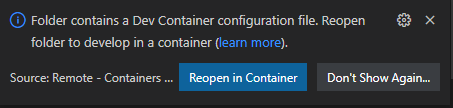

3. Click on the button 'Reopen in Container'
4. Visual Studio Code opens the Dev Container. If it's the first time you open the project in container mode, it first builds the container, it can take several minutes to build the new container.
5. Once the container is loaded, you can open a new terminal (Terminal -> New Terminal).
6. And from the terminal, you have access to the tools installed in the Dev Container like az client,....

    ```bash
        vscode ➜ /workspace $ az login 
    ```

### How to deploy infrastructure and launch load test from the Dev Container terminal

The Dev Container is now running, you can use the bash file [./devops-pipelines/utils/load-testing-tool.sh](./projects/[projectName]/scripts/load-testing-tool.sh) to:

- deploy the infrastructure with Azure Event Hubs
- deploy the Load Testing infrastructure
- prepare the network configuration for the tests
- launch the Load Tests
- restore the network configuration
- undeploy the Load Testing infrastructure
- undeploy the infrastructure

If you are not interested in running the load testing manually from the Dev Container terminal, you can directly jump to the chapter [Using Azure DevOps pipelines and Github Actions](#using-azure-devops-pipelines-and-github-actions) to automate the infrastructure deployment and load tests.

Below the list of arguments associated with 'load-testing-tool.sh':

- -a  Sets iactool action {login, install, createconfig, deploy, undeploy, deploytest, undeploytest, opentest, runtest, closetest}
- -c  Sets the iactool configuration file
- -r  Sets the Azure Region for the deployment

#### Installing the pre-requisites on the host machine

Follow the steps below to install the pre-requisites on your host machine which could be the Azure DevOps Agent or a Github Agent. As currently the pre-requisite includes only the Azure CLI, this step is not required for the Dev Container environment as Azure CLI is already installed in the Dev Container.

1. You can launch the installation of the pre-requisites using the command below with the action "install"

    ```bash
        vscode ➜ /workspace $ ./projects/[projectName]/scripts/load-testing-tool.sh  -a install
    ```

2. Once the pre-requisites are installed, launch the Azure login process using 'load-testing-tool.sh -a login'.  
Usually this step is not required in a pipeline as the connection with Azure is already established.

    ```bash
        vscode ➜ /workspace $ ./projects/[projectName]/scripts/load-testing-tool.sh  -a login
    ```
    
    After this step the default Azure subscription has been selected. You can still change the Azure subscription, using Azure CLI command below:

    ```bash
        vscode ➜ /workspace $ az account set --subscription <azure-subscription-id>
    ```

3. Once you are connected to your Azure subscription, you can create the configuration file which is used to deploy the infrastructure.

    ```bash
        vscode ➜ /workspace $ ./projects/[projectName]/scripts/load-testing-tool.sh  -a createconfig -c ./projects/[projectName]/configuration/.default.env -r 'eastus2' 
    ```

    After this step, the variables AZURE_REGION, AZURE_TEST_SUFFIX, AZURE_SUBSCRIPTION_ID and AZURE_TENANT_ID used for the deployment are stored in the file ./projects/[projectName]/configuration/.default.env.

    ```bash
        vscode ➜ /workspace $ cat ./projects/[projectName]/configuration/.default.env
        AZURE_REGION="eastus2"
        AZURE_TEST_SUFFIX=evhub5039
        AZURE_SUBSCRIPTION_ID=XXXXXXXX-XXXX-XXXX-XXXX-XXXXXXXXXXXX
        AZURE_TENANT_ID=XXXXXXXX-XXXX-XXXX-XXXX-XXXXXXXXXXXX
    ```

    AZURE_REGION defines the Azure region where you want to install your infrastructure, it's 'eastus2' by default.
    AZURE_TEST_SUFFIX defines the prefix which is used to name the Azure resources. By default this prefix includes 4 random digits which are used to avoid naming conflict when a resource with the same name has already been deployed in another subscription.
    AZURE_SUBSCRIPTION_ID is the Azure Subscription Id where you want to install your infrastructure
    AZURE_TENANT_ID is the Azure Tenant Id used for the authentication.

#### Deploying the infrastructure

Once the pre-requisites are installed and the configuration ready, you can deploy the infrastructure you want to test, using the following arguments:

```bash
    vscode ➜ /workspace $ ./projects/[projectName]/scripts/load-testing-tool.sh  -a deploy -c ./projects/[projectName]/configuration/.default.env 
```

After few minutes, the resources are visible on the Azure Portal.

#### Deploying the load testing infrastructure

Once the infrastructure is deployed, you can deploy the load testing infrastructure, using the following arguments:

```bash
    vscode ➜ /workspace $ ./projects/[projectName]/scripts/load-testing-tool.sh  -a deploytest -c ./projects/[projectName]/configuration/.default.env 
```

This step deploys at least the following resources:

- Azure Load Testing
- Key vault

It assigns at least the following roles:

- 'Load Test Contributor' for the current user on the Load Testing scope
- 'Key Vault Secrets Officer' for the current user on the Key Vault scope
- 'Key Vault Secrets User' for the Load Testing identity on the Key Vault scope

#### Opening the access to Azure Event Hubs and Azure Key Vault

Once the load testing infrastructure is deployed, you need at least to open the access to :

- the resource to test 
- Azure Key Vault for the current user or current service principal and Azure Load Testing.

The command line below configures the network access to Azure Event Hubs and Azure Key Vault:

```bash
    vscode ➜ /workspace $ ./projects/[projectName]/scripts/load-testing-tool.sh  -a opentest -c ./projects/[projectName]/configuration/.default.env 
```

This step opens at least the access to Azure Key Vault.

#### Running the load test scenario

Once the Azure Event Hubs and Azure Key Vault are configured, you can launch the load test scenario with the following command line.

```bash
    vscode ➜ /workspace $ ./projects/[projectName]/scripts/load-testing-tool.sh  -a runtest -c ./projects/[projectName]/configuration/.default.env 
```

By default, the load test scenario runs with the following parameters:

- duration: 60 seconds
- Threads: 1 thread
- Engine Instances: 1
- Error trigger: 5%
- Average Response Time trigger: 100ms

You can change those parameters in editing the variables below in the configuration file, for instance: ./projects/[projectName]/configuration/.default.env

```bash
LOAD_TESTING_DURATION=60
LOAD_TESTING_THREADS=1
LOAD_TESTING_ENGINE_INSTANCES=1
LOAD_TESTING_ERROR_PERCENTAGE=5
LOAD_TESTING_RESPONSE_TIME=100
```

This step is a journey between the different status of the Azure Load Testing Test instance:

- ACCEPTED: The load testing configuration with the JMX file and CSV files has been accepted
- PROVISIONING: The load testing service is provisioning the resources for the test
- CONFIGURING: The load testing service is configuring the resources
- EXECUTING: The load testing service is executing the test
- DONE: the test is completed

Once the test is completed, when the result status is "PASSED", the results of the test are available, and the bash file displays the results:

```json
    {
      "Metrics Request": {
        "transaction": "Metrics Request",
        "sampleCount": 1309,
        "errorCount": 0,
        "errorPct": 0,
        "meanResTime": 21.255156608097785,
        "medianResTime": 19,
        "maxResTime": 107,
        "minResTime": 16,
        "pct1ResTime": 25,
        "pct2ResTime": 31,
        "pct3ResTime": 73,
        "throughput": 22.19,
        "receivedKBytesPerSec": 0,
        "sentKBytesPerSec": 0
      },
      "Logs Request": {
        "transaction": "Logs Request",
        "sampleCount": 1309,
        "errorCount": 0,
        "errorPct": 0,
        "meanResTime": 23.804430863254392,
        "medianResTime": 19,
        "maxResTime": 371,
        "minResTime": 16,
        "pct1ResTime": 41,
        "pct2ResTime": 49,
        "pct3ResTime": 79,
        "throughput": 22.19,
        "receivedKBytesPerSec": 0,
        "sentKBytesPerSec": 0
      },
      "Total": {
        "transaction": "Total",
        "sampleCount": 2618,
        "errorCount": 0,
        "errorPct": 0,
        "meanResTime": 22.529793735676087,
        "medianResTime": 19,
        "maxResTime": 371,
        "minResTime": 16,
        "pct1ResTime": 28,
        "pct2ResTime": 48,
        "pct3ResTime": 76,
        "throughput": 44.37,
        "receivedKBytesPerSec": 0,
        "sentKBytesPerSec": 0
      }
    }
```

For this step, the bash file uses curl commands to call the Azure Load Testing Data Plane REST API defined [here](https://learn.microsoft.com/en-us/rest/api/loadtesting/) to create, configure, run and monitor the load test.

#### Closing the access to Azure Event Hubs and Azure Key Vault

If you don't want to run any new load test, you can close the access to the Azure Event Hubs and Azure Key Vault, with the following command line:

```bash
    vscode ➜ /workspace $ ./projects/[projectName]/scripts/load-testing-tool.sh  -a closetest -c ./projects/[projectName]/configuration/.default.env 
```

#### Undeploying the load testing infrastructure

You can also undeploy the load testing infrastructure with the following command:

```bash
    vscode ➜ /workspace $ ./projects/[projectName]/scripts/load-testing-tool.sh  -a undeploytest -c ./projects/[projectName]/configuration/.default.env 
```

#### Undeploying the infrastructure

Once the load testing infrastructure is undeployed, you can undeploy the infrastructure using load-testing-tool.sh with action 'undeploy'.
For instance the following command:

```bash
    vscode ➜ /workspace $ ./projects/[projectName]/scripts/load-testing-tool.sh  -a undeploy -c ./projects/[projectName]/configuration/.default.env 
```

## Using Azure DevOps pipelines and Github Actions

In this chapter, you will use Azure DevOps pipeline and/or Github Action to automate the deployment of the infrastructure and the launch of the load test for a project called [projectName].  

The pipelines (Azure DevOps pipelines and Github Actions) running Event Hub load testing includes the following steps:

- deploy the infrastructure to test
- deploy the load testing infrastructure
- update the infrastructure for the load test
- run the load testing
- update the infrastructure after the load test
- publish the load testing results  

### Creating the Service Principal for Github Action and Azure DevOps pipelines Azure Authentication  

If you want to use Azure DevOps pipelines or Github Actions, an authentication with Azure using a Service Principal is required.

In order to create this service principal you can use the following bash file: [scripts/create-rbac-sp.sh](./scripts/create-rbac-sp.sh)

This bash file assigns the role "Load Test Contributor" to the service principal, this role is mandatory to deploy and run Azure Load Testing from an Azure DevOps pipeline or a Github Action.

Before running this bash file you need to be connected with your Azure Account using Azure CLI. Run 'az login' in your linux environment or in your Dev Container Terminal

```bash
    vscode ➜ /workspace $ az login
```

Once you are connected with Azure, you can run the following bash to create the Service Principal:

```bash
    vscode ➜ /workspace $ ./devops-pipelines/utils/create-rbac-sp.sh -s <Azure-Subscription-Id> -a <Service-Principal-Name>
```

where \<Azure-Subscription-Id\> is the subscriptionId of your Azure Account and \<Service-Principal-Name\> the name of the service principal which is created.  
Once completed, this bash file displays the information required for the Azure authentication with GitHub Action and Azure DevOps pipeline.

For instance:

```bash
    vscode ➜ /workspace $ ./devops-pipelines/utils/create-rbac-sp.sh -s d3814ade-afe8-4260-9b5f-************ -a sp-loadtest-01
```

The bash file displays the following information in Json format:

```bash
    {
    "clientId": "********-****-****-****-************",
    "clientSecret": "************",
    "subscriptionId": "********-****-****-****-************",
    "tenantId": "********-****-****-****-************",
    "activeDirectoryEndpointUrl": "https://login.microsoftonline.com",
    "resourceManagerEndpointUrl": "https://management.azure.com/",
    "activeDirectoryGraphResourceId": "https://graph.windows.net/",
    "sqlManagementEndpointUrl": "https://management.core.windows.net:8443/",
    "galleryEndpointUrl": "https://gallery.azure.com/",
    "managementEndpointUrl": "https://management.core.windows.net/"
    }
```

In the subsequent chapter, you'll see how to use this Json string to create the Github Action Secret AZURE_CREDENTIALS and how to use the clientId and clientSecret values to create the Azure DevOps Service Connection.

The creation of this service principal with your Azure Account may fail with the following error: "insufficient privileges to complete the operation", in that case, you'll need to contact your Azure Active Directory Administrator to create the Service Principal for you.

### Azure DevOps pipeline

The service principal for the Azure DevOps pipeline has been created, you can use Azure DevOps to create load testing pipelines.

The diagram below describes the architecture for this test with with Azure DevOps:

- a resource group associated with the infrastructure to test
- a resource group associated with the load testing infrastructure
- the Azure DevOps resources repository, pipeline and artifact

  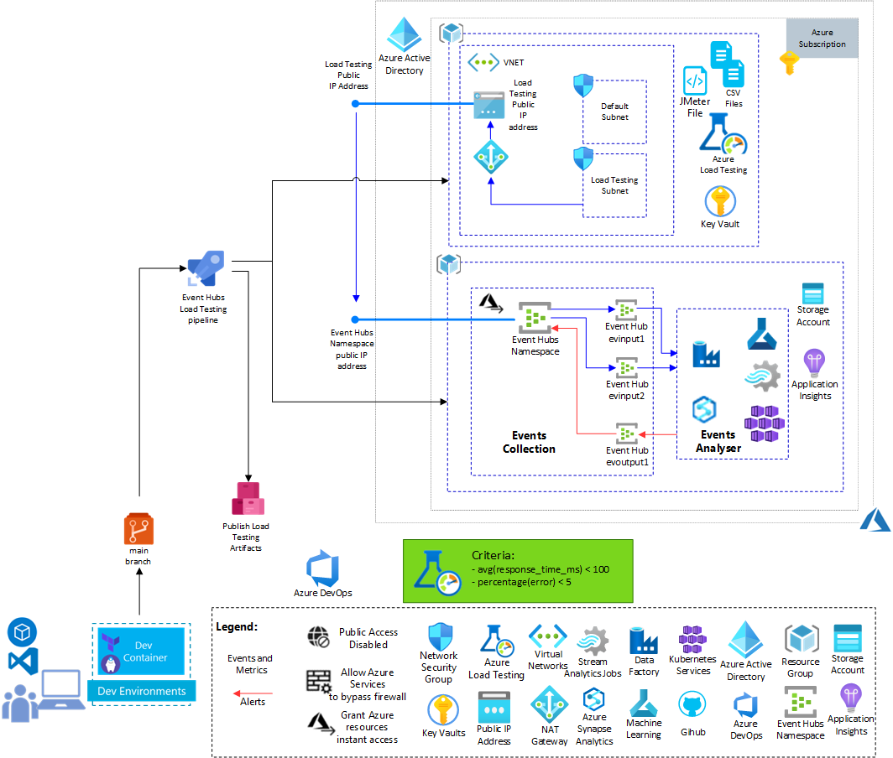

*Download a [SVG file](./docs/img/load-testing-event-hubs-restricted-public-access/architecture-scenario-load-testing-azdo.svg) of this diagram.*

#### **Link your Azure DevOps project with the GitHub repository**
<!-- markdown-link-check-disable -->
1. Navigate on your Azure DevOps organization "https://dev.azure.com/YOUR_ORG"

    
<!-- markdown-link-check-enable -->
2. Click on the button '+ New project'

3. On the 'Create new project' page enter the name of your project and click on the button 'Create'

    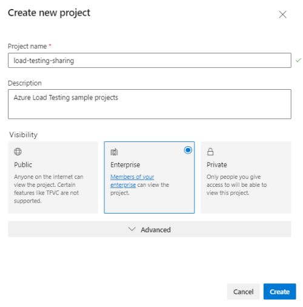

4. On the main page of your project on Azure DevOps portal, select 'Repos' -> 'Files' page.

    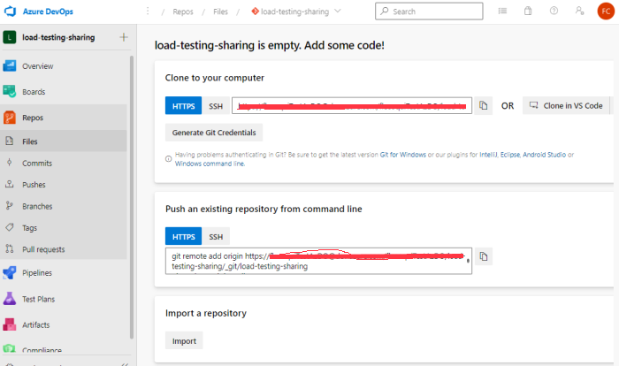

5. On this page, click on the 'import' button in the'Import a repository' section.

6. On the Import a Git repository page, enter the url of the git repository where you stored the source code of this project.

    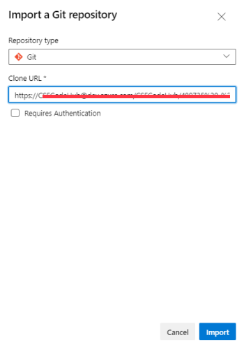

7. Click on the button 'Import', after few seconds the repository is imported.

    

#### **Install Azure Load Testing from the Azure DevOps Market Place**

As the new pipeline runs Azure Load Testing, you need to install the Azure Load Testing for Azure DevOps.

1. Click on the Market Place icon to browse the market place  


2. Search for the Azure Load Testing component  


3. On the Azure Load Testing page click on the button "Get it Free"  
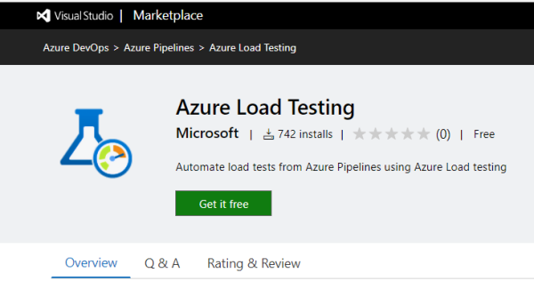

4. On the Market Place page click on the button "Install"  
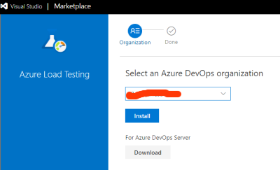

5. After few seconds the component is installed, Go back to Azure DevOps portal clicking on button "Proceed to organization"  


You can now create the service connection for the authentication with your Azure Account, the Variable Group and the Azure DevOps pipeline.

#### **Create Azure DevOps Service Connection, Variable Group and pipeline**

In order to create the service connection, Variable Group and pipeline you can use the following bash file: [scripts/create-azdo-resources.sh](./scripts/create-azdo-resources.sh)  
This bash file creates:

- the service connection for the authentication with Azure Subscription. The name of this service connection is the name of the service principal created in the previous step with the prefix "sc-".
- the variable group which contains the parameters of the pipeline like AZURE_TEST_SUFFIX, AZURE_REGION, SERVICE_CONNECTION. By default the name of this variable group is "load-testing-vg". If you want to change this name, you'll have to update the file [scripts/create-azdo-resources.sh](./scripts/create-azdo-resources.sh) and the pipeline file [azure-pipelines-load-testing.yml](./projects/eventhub/devops-pipelines/azure-pipelines/azure-pipelines-load-testing.yml).
- the Azure DevOps pipeline to run the load testing. By default, the name of the pipeline is "Load-Testing-EventHubs". If you want to change this name, you'll have to update the file [scripts/create-azdo-resources.sh](./scripts/create-azdo-resources.sh).
By default, the pipeline file should be present in the "main" branch, if it's not the case, you also need to update the file [scripts/create-azdo-resources.sh](./scripts/create-azdo-resources.sh).
  
Before running this bash file you need to be connected with your Azure Account using Azure CLI. Run 'az login' in your linux environment or in your Dev Container Terminal

```bash
    vscode ➜ /workspace $ az login
```

Once you are connected with Azure, you can run the following bash to create the Service Principal:

```bash
    vscode ➜ /workspace $ ./scripts/create-azdo-resources.sh -o "<MyORG>" -p "<MyProject>" -y "<MyRepository>" -s "<Azure-Subscription-Id>"  -t "<Azure-Tenant-Id>" -i "<ServicePrincipalId>" -k "<ServicePrincipalKey>"
```

where:

- \<MyORG\> is the name of your DevOps organization,
- \<MyProject\> is the name of your project,
- \<MyRepository\> is the name of your repository where the pipeline is stored,
- \<Azure-Subscription-Id\> is the subscriptionId of your Azure Account,
- \<Azure-Tenant-Id\> is the Tenant Id of your Azure AD Tenant,
- \<ServicePrincipalId\> is the value "clientId" of your Service Principal created with the bash file [scripts/create-rbac-sp.sh](./scripts/create-rbac-sp.sh),
- \<ServicePrincipalKey\> is the value "clientSecret" of your Service Principal created with the bash file [scripts/create-rbac-sp.sh](./scripts/create-rbac-sp.sh),

For instance:

```bash
        vscode ➜ /workspace $ ./scripts/create-azdo-resources.sh -o "TestAzDO" -p "load-testing-sharing" -y "load-testing-restricted-public-access" -s "d3814ade-afe8-4260-9b5f-xxxxxxxxxxxx"  -t "6a13df32-a807-43c4-8277-xxxxxxxxxxxx" -i "1d736738-9c5f-4de7-84f9-xxxxxxxxxxxx" -k "ok-8Q~Rsxxxxxxxxxxxx"
```

Once completed, this bash file displays the information about the different resources created.

```bash
  Creating Service Connection for:
    Subscription: d3814ade-afe8-4260-9b5f-xxxxxxxxxxxx
    Tenant: 6a13df32-a807-43c4-8277-xxxxxxxxxxxx
    Service Principal Id: 1d736738-9c5f-4de7-84f9-xxxxxxxxxxxx
  Creating Service Connection...
  Updating Service Connection to allow all pipelines...
  Creating Variables Group 'load-testing-vg' for:
    Organization: 'https://dev.azure.com/TestAzDO/'
    Project: 'load-testing-sharing'
  Creating Variables Group...
  Creating Pipeline 'Load-Testing-EventHubs' for:
    Organization: 'https://dev.azure.com/TestAzDO/'
    Project: 'load-testing-sharing'
  Creating Pipeline...
  Pipeline 'Load-Testing-EventHubs' created.
```

You can now check whether the service connection, the variable group and pipeline have been created.

1. On the main page of your project on Azure DevOps portal, select 'Project Settings' -> 'Service Connections' page. You should see the new service  connection with the prefix "sc-".  

    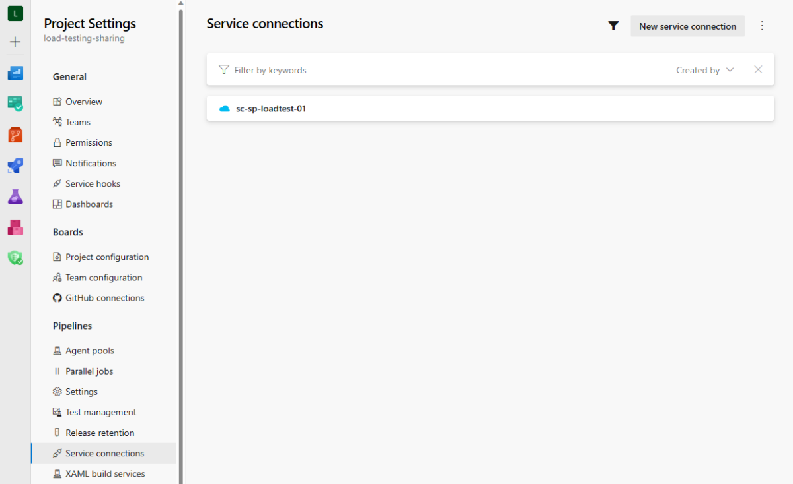

2. On the main page of your project on Azure DevOps portal, select 'Pipelines' -> 'Library' page. You should see the new variable group "load-testing-vg".  

    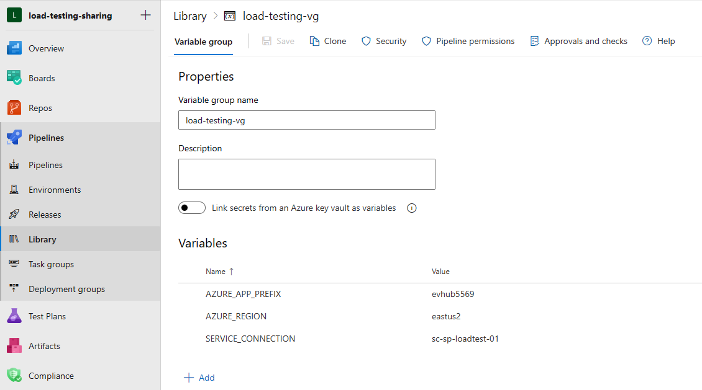

3. On the main page of your project on Azure DevOps portal, select 'Pipelines' -> 'Pipelines' page. You should see the new pipeline "Load-Testing-EventHubs".  

    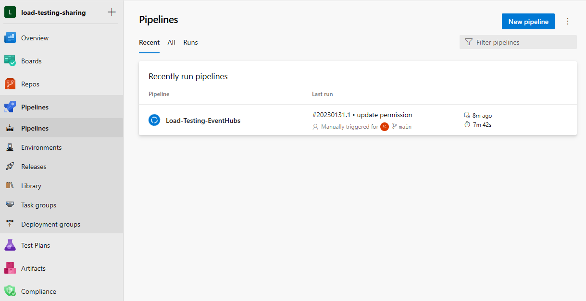

4. You can now click on the "Run pipeline" button to run manually the pipeline.
5. On the dialog box 'Run pipeline',  
    - select the 'main' branch,  
    - select the EventHubs Sku "Basic", "Standard", "Premium" ("Standard" by default),  
    - enter the duration of the test in seconds (60 seconds by default),  
    - enter the number of threads for the load testing (1 by default),  
    - enter the number of engine instances for the load testing (1 by default),  
    - enter the error percentage threshold for the load testing (5 by default),  
    - enter the average response time in milliseconds threshold for the load testing (100 by default),  
  Then click on the button "Run"

    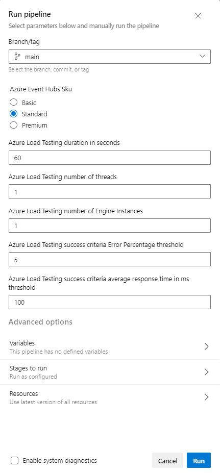

6. After few minutes, the pipeline is completed and you can download and visualize the results on the Azure Portal.

    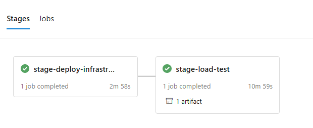

7. On the Azure Load Testing result page, you can see the requests/sec and the response time for the Event Hubs REST API requests towards both Event Hub inputs.

    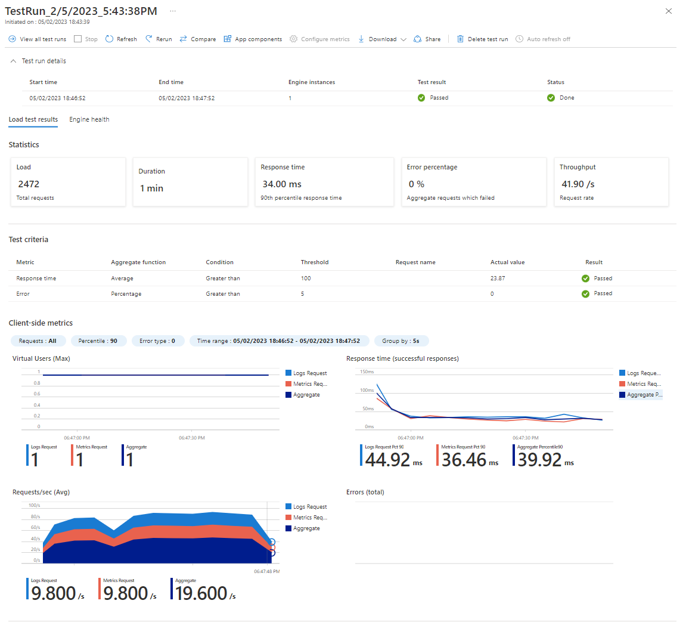

    **Note:**
    As the Azure Load Testing resource has been created in the pipeline, by default, you don't have access to this resource.
    The Azure Load Testing resource is present in the resource group whose name starts with "rgldtestevhub".  
    You will probably see the message below:  

    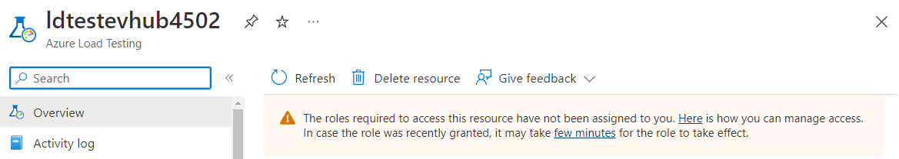

    You need to assign the role "Load Test Contributor" to your Azure AD Account for the Azure Load Testing scope.  
    After few minutes you should have access to the page which displays the test results.

### Github Action

You can also use Github Action to automate the load testing of the same infrastructure based on Azure Event Hubs:

The diagram below describes the architecture for this test with Github Action:

- a resource group associated with the Event Hubs based infrastructure to test  
- a resource group associated with the load testing infrastructure and the Virtual Network  
- the Github resources repository, Github Action and artifact  
  
  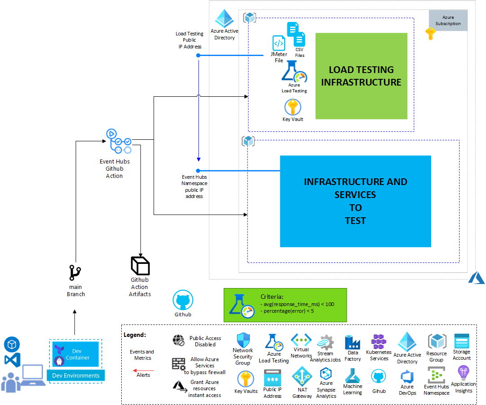

*Download a [SVG file](./docs/img/load-testing-event-hubs-restricted-public-access/architecture-scenario-load-testing-github-action.svg) of this diagram.*

First, you need to create the Github Action Secret AZURE_CREDENTIALS for the authentication with Azure.

#### **Create Github Action Secret AZURE_CREDENTIALS**

1. On the GitHub portal where you store your project, navigate on the the page 'Settings' and select the submenu 'Actions' in the menu 'Secrets and variables' and select the tab 'Secrets' on the page 'Actions secrets and variables'.

    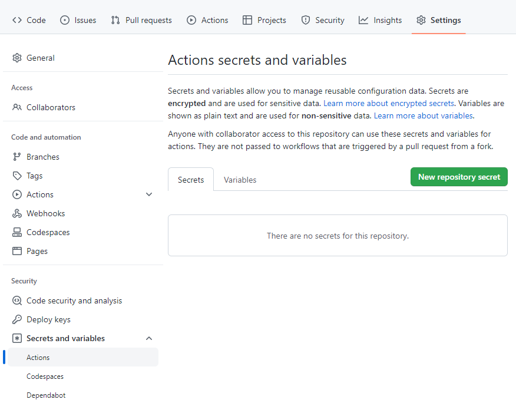

2. Click on 'New repository secret' button, enter 'AZURE_CREDENTIALS' in the Name field and copy/paste the JSON value associated with the service principal created with create-rbac-sp.sh.

    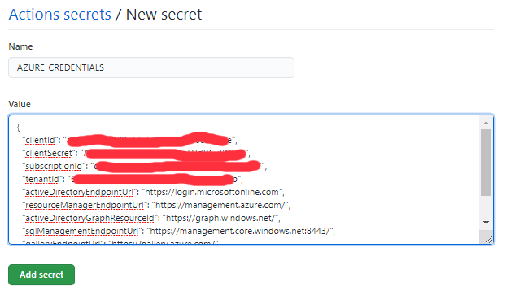

3. Click on 'Add secret' button. The new secret will be accessible on the Secret page.  

    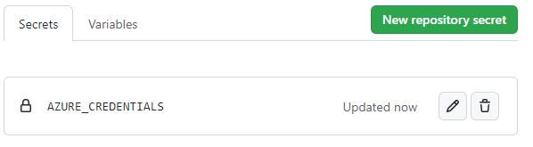

#### **Create Github Action configuration variables**

Before installing the Github Action, you need to create the configuration variables which will be used by the Github Action:

- AZURE_REGION: The Azure region where the service will be deployed, for instance: 'eastus2'
- AZURE_TEST_SUFFIX: The suffix which it used to give a name to all the Azure resources.

When you enter the value of AZURE_TEST_SUFFIX, select a value which will not generate an Azure resource name which already exists.
You can use the command line below to generate a value which will avoid any conflict with existing Azure Storage, Azure Key Vault and Azure Events Hubs:

```bash
  vscode ➜ /workspace $ ./projects/[projectName]/scripts/load-testing-tool.sh  -a getsuffix 
```

1. On the GitHub portal page associated with your project, navigate on the the page 'Settings' and select the submenu 'Actions' in the menu 'Secrets and variables' and select the tab 'Variables' on the page 'Actions secrets and variables'.

    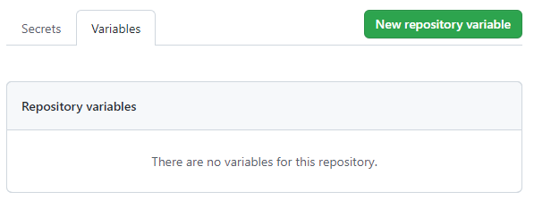

2. Click on 'New repository variable' button, enter 'AZURE_REGION' in the 'Name' field and the Azure region in the 'Value' field and click on the 'Add variable' button.

3. Click on 'New repository variable' button, enter 'AZURE_TEST_SUFFIX' in the 'Name' field and enter the suffix in the 'Value' field and click on the 'Add variable'

    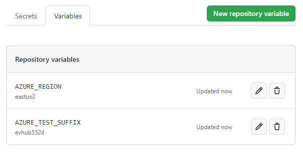

#### **Create Github Action pipeline for Event Hubs with restricted public access Load Testing**

By default, all the Github Action pipelines are stored under 'devops-pipelines/github-action'.
The Load Testing Github Action pipeline is [github-action-load-testing.yml](projects/eventhub/devops-pipelines/github-action/github-action-load-testing.yml)

In order to activate this pipeline, follow the steps below:

1. Create a folder '.github/workflows' in your repository
2. Copy the file github-action-load-testing.yml in the folder '.github/workflows'
3. Commit and push this modification in your "main" branch

    ```bash
      git add  .github/workflows/github-action-load-testing.yml
      git commit -m "Create Eventhub Load with restricted public access Testing Github Action"
      git push
    ```

4. Once the new pipeline is pushed into the main branch, you can launch manually the Github Action. On the GitHub portal, on the 'Action' page, select the workflow 'load-testing-eventhub-restricted-public-access' and click on the button 'Run workflow'. If required you can change the following input parameters:

   - Github branch: main by default
   - Azure Eventhub Sku: Standard by default
   - Load Testing duration: 60 seconds by default
   - Load Testing number of threads: 1 by default
   - Load Testing number of engine instances: 1 by default  
   - Load Testing error percentage threshold: 5% by default  
   - Load Testing average response time in milliseconds threshold: 100 ms by default  
   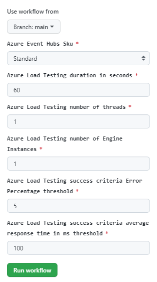

5. After few minutes, the pipeline has been completed and you can download the load testing artifacts.  

    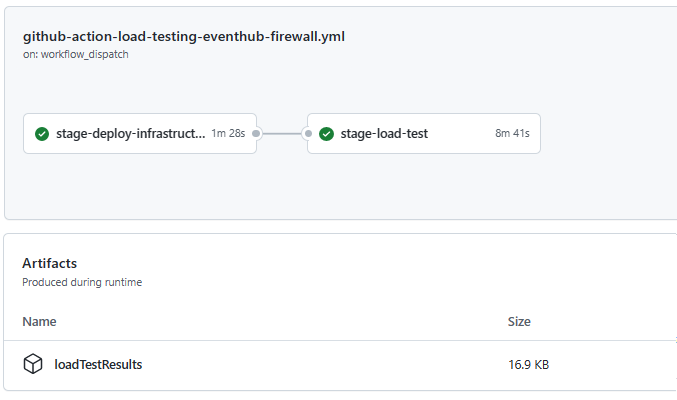


## List of sample projects

### Azure Event Hubs with public access restriction (Project Name: eventhub)

This project consists in testing an architecture based on Azure Event Hubs with public access restriction.
The Azure Event Hubs endpoint is accessible from the services whose source IP address is allowed (defined in the Azure Event Hubs firewall IP addresses list).  
This service based on Azure Event Hubs could be for instance used to analyze events and metrics coming from different sources on Internet. Those sources are allowed in adding the source IP addresses in the Azure Event Hubs firewall IP address list.
The events and metrics are analyzed using different possible Azure Resources like Azure Stream Analytics, Azure Data Factory, Synapse Analytics, Azure Machine Learning, containers running on Azure Kubernetes Service, ...
Once the events and metrics are analyzed, an event could be raised and sent to the Azure Event Hub output.

  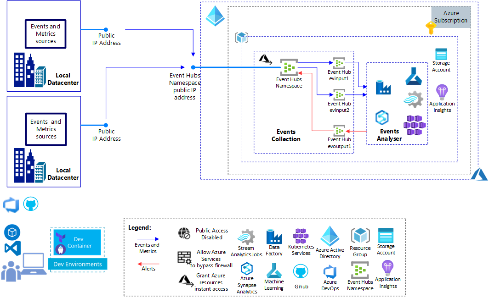

*Download a [SVG file](./projects/eventhub/docs/img/load-testing-event-hubs-restricted-public-access/architecture-scenario.svg) of this diagram.*

Moreover, this project subfolder contains the code to run Azure Load Testing against Azure Event Hubs whose public network access is restricted. In that case, the load testing infrastructure is extended with an Azure Virtual Network and an Azure NAT Gateway to use the same source public IP address for the requests coming from the load testing infrastructure.
This source public IP address is added in the Event Hub firewall configuration before running the tests and removed once the tests are completed.
The infrastructure is also extended with an Azure Key Vault which is used to store the secrets like the EventHubs tokens.

  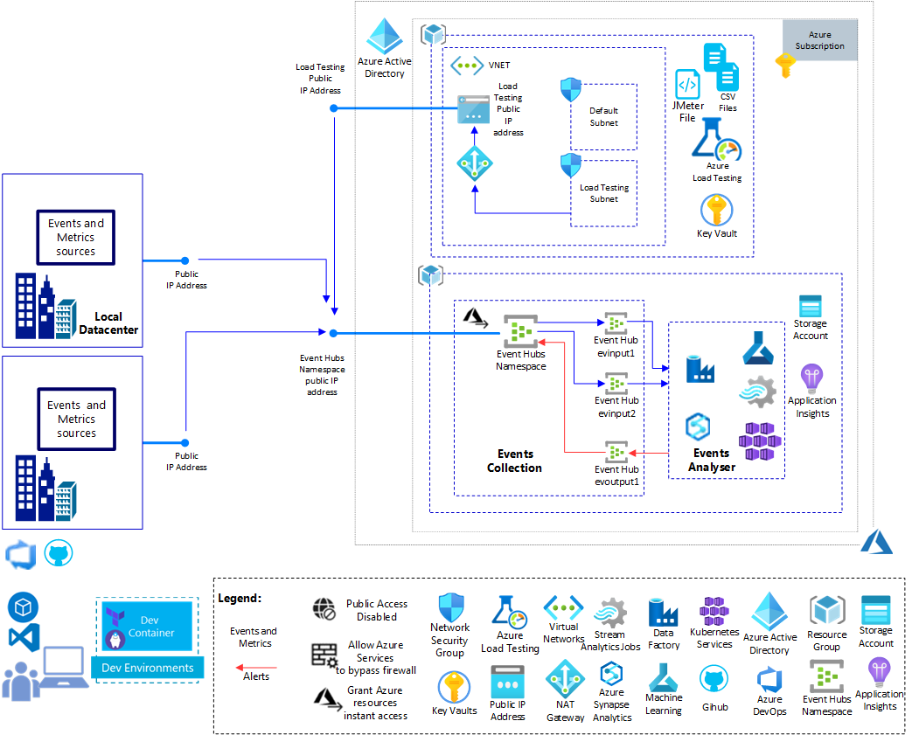

*Download a [SVG file](./projects/eventhub/docs/img/load-testing-event-hubs-restricted-public-access/architecture-scenario-load-testing.svg) of this diagram.*

Project documentation in this file: [README.md](./projects/eventhub/README.md) 

## Contribute

This project welcomes contributions and suggestions. Further information about contributions in this [document](./CONTRIBUTING.md)
