# Using Azure Load Testing to test Multi-Tenant services   

## Table of Contents

- [Introduction](#introduction)
- [Features and architectures](#features-and-architectures)
- [Getting started](#getting-started)
- [Using Azure DevOps pipelines and Github Actions](#using-azure-devops-pipelines-and-github-actions)
- [Under the hood](#under-the-hood)
- [Contribute](#contribute)

## Introduction

This Azure Load Testing sample describes how to test a Multi-Tenant Application based on an frontend hosted on Azure Static Web App, a backend (REST API) hosted on Azure Function and a Database hosted in a table on Azure Storage. This sample will run load testing for several users hosted in different Microsoft Entra ID, the Microsoft Entra ID token associated witheach user will be stored in the Azure Key Vault associated with the Azure Load Testing infrastructure. 

This repository contains:

- bash files and ARM templates to:
  - build/deploy/undeploy the infrastructure and the services to test,
  - deploy/undeploy the load testing infrastructure
  - open/close the access to Azure Key Vault from Azure Load Testing
  - run the load test
- bash file to create the users used for the tests in a Microsoft Entra ID tenant
- an Azure DevOps pipeline and a Github Action to automate the load testing scenario.

The pipelines (Azure DevOps pipelines and Github Actions) running multi-tenant load testing includes the following steps:

- deploy the infrastructure to test and build the services to test
- deploy the load testing infrastructure
- update the infrastructure for the load test
- run the load testing
- update the infrastructure after the load test
- publish the load testing results  

## Features and architectures

This chapter describes the architecture based on Azure Static Web App, Azure Function and Azure Storage to host the multi-tenant service.
As the backend (REST API) is running in a container, an Azure Container Registry is used to store the container images.
  
This service based on Azure Static Web App, Azure Function and Azure Storage could be for instance a Teams Application.

  

*Download a [SVG file](./docs/img/load-testing-web-app-auth/architecture-scenario.svg) of this diagram.*

This repository contains the code associated with:

- the frontend: a basic HTML/Javascript application calling the backend REST API once the user is authentified, 
- the backend: a REST API which record the visit in an Azure Storage table. Each record in the table contains the user's Tenant Id and the user's mail address.

Moreover, it contains the code to run Azure Load Testing against the REST API which required a user authentication. 
The Azure Load Testing infrastructure is extended with an Azure Key Vault which is used to store the user's Microsoft Entra Id tokens.

  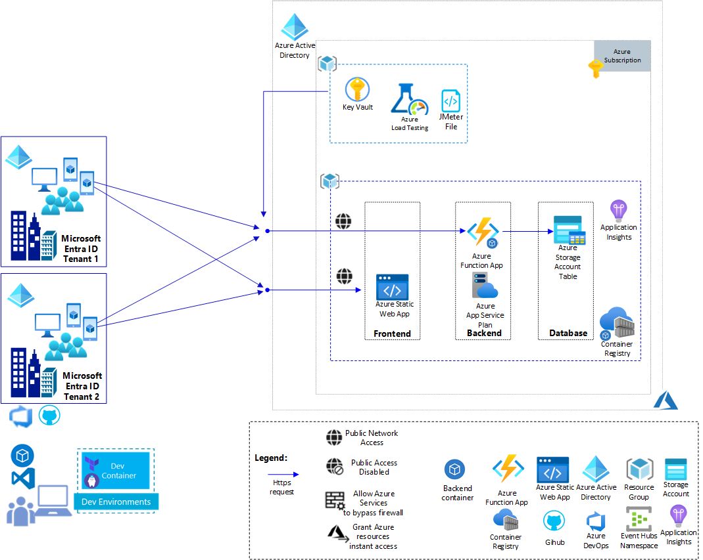

*Download a [SVG file](./docs/img/load-testing-web-app-auth/architecture-scenario-load-testing.svg) of this diagram.*

## Getting started

This chapter describes how to :

1. Install the pre-requisites including Visual Studio Code, Dev Container
2. Create, deploy and run the load tests
  
This repository contains the following resources :

- A Dev container under '.devcontainer' folder
- The Azure configuration for a deployment under 'configuration' folder
- The pipelines (Azure DevOps pipeline, Github Action) used to run the load testing scenarios and the bash files used to create and run the pipelines under 'devops-pipeline' folder
- The ARM templates used to deploy the target infrastructure and the load testing resources under 'infra' folder

### Installing the pre-requisites

In order to test the solution, you need first an Azure Subscription, you can get further information about Azure Subscription [here](https://azure.microsoft.com/en-us/free).

You also need to install Git client and Visual Studio Code on your machine, below the links.

|[](https://git-scm.com/download/win) |[](https://git-scm.com/download/linux)|[](https://git-scm.com/download/mac)|
|:---|:---|:---|
| [Git Client for Windows](https://git-scm.com/download/win) | [Git client for Linux](https://git-scm.com/download/linux)| [Git Client for MacOs](https://git-scm.com/download/mac) |
[Visual Studio Code for Windows](https://code.visualstudio.com/Download)  | [Visual Studio Code for Linux](https://code.visualstudio.com/Download)  &nbsp;| [Visual Studio Code for MacOS](https://code.visualstudio.com/Download) &nbsp; &nbsp;|

Once the Git client is installed you can clone the repository on your machine running the following commands:

1. Create a Git directory on your machine

    ```bash
        c:\> mkdir git
        c:\> cd git
        c:\git>
    ```

2. Clone the repository.  
    For instance:

    ```bash
        c:\git> git clone  https://github.com/Azure-Samples/load-testing-restricted-public-access.git 
        c:\git> cd ./load-testing-restricted-public-access 
        c:\git\load-testing-restricted-public-access> 
    ```

### Using Dev Container

#### Installing Dev Container pre-requisites

You need to install the following pre-requisite on your machine

1. Install and configure [Docker](https://www.docker.com/get-started) for your operating system.

   - Windows / macOS:

     1. Install [Docker Desktop](https://www.docker.com/products/docker-desktop) for Windows/Mac.

     2. Right-click on the Docker task bar item, select Settings / Preferences and update Resources > File Sharing with any locations your source code is kept. See [tips and tricks](https://code.visualstudio.com/docs/remote/troubleshooting#_container-tips) for troubleshooting.

     3. If you are using WSL 2 on Windows, to enable the [Windows WSL 2 back-end](https://docs.docker.com/docker-for-windows/wsl/): Right-click on the Docker taskbar item and select Settings. Check Use the WSL 2 based engine and verify your distribution is enabled under Resources > WSL Integration.

   - Linux:

     1. Follow the official install [instructions for Docker CE/EE for your distribution](https://docs.docker.com/get-docker/). If you are using Docker Compose, follow the [Docker Compose directions](https://docs.docker.com/compose/install/) as well.

     2. Add your user to the docker group by using a terminal to run: 'sudo usermod -aG docker $USER'

     3. Sign out and back in again so your changes take effect.

2. Ensure [Visual Studio Code](https://code.visualstudio.com/) is already installed.

3. Install the [Remote Development extension pack](https://marketplace.visualstudio.com/items?itemName=ms-vscode-remote.vscode-remote-extensionpack)

#### Using Visual Studio Code and Dev Container

1. Launch Visual Studio Code in the folder where you cloned the load-testing-restricted-public-access repository

    ```bash
        c:\git\load-testing-restricted-public-access> code .
    ```

2. Once Visual Studio Code is launched, you should see the following dialog box:

    

3. Click on the button 'Reopen in Container'
4. Visual Studio Code opens the Dev Container. If it's the first time you open the project in container mode, it first builds the container, it can take several minutes to build the new container.
5. Once the container is loaded, you can open a new terminal (Terminal -> New Terminal).
6. And from the terminal, you have access to the tools installed in the Dev Container like az client,....

    ```bash
        vscode ➜ /workspace $ az login 
    ```

### How to deploy infrastructure and launch load test from the Dev Container terminal

The Dev Container is now running, you can use the bash file [./scripts/load-testing-tool.sh](./scripts/load-testing-tool.sh) to:

- deploy the infrastructure with Azure Static Web App, Azure Function and Azure Storage
- deploy the Load Testing infrastructure
- prepare the network configuration for the tests
- launch the Load Tests
- restore the network configuration
- undeploy the Load Testing infrastructure
- undeploy the infrastructure

If you are not interested in running the load testing manually from the Dev Container terminal, you can directly jump to the chapter [Using Azure DevOps pipelines and Github Actions](#using-azure-devops-pipelines-and-github-actions) to automate the infrastructure deployment and load tests.

Below the list of arguments associated with 'load-testing-tool.sh':

- -a  Sets action {login, install, createconfig, deploy, createapp, deployservices, undeploy, deploytest, undeploytest, opentest, runtest, closetest}
- -c  Sets the configuration file
- -h  Azure Function Sku - by default B1 (B1, B2, B3, S1, S2, S3)
- -r  Sets the Azure Region for the deployment

#### Installing the pre-requisites on the host machine

Follow the steps below to install the pre-requisites on your host machine which could be the Azure DevOps Agent or a Github Agent. As currently the pre-requisite includes only the Azure CLI, this step is not required for the Dev Container environment as Azure CLI is already installed in the Dev Container.

1. You can launch the installation of the pre-requisites using the command below with the action "install"

    ```bash
        vscode ➜ /workspace $ ./projects/web-app-auth/scripts/load-testing-tool.sh  -a install
    ```

2. Once the pre-requisites are installed, launch the Azure login process using 'load-testing-tool.sh -a login'.  
Usually this step is not required in a pipeline as the connection with Azure is already established.

    ```bash
        vscode ➜ /workspace $ ./projects/web-app-auth/scripts/load-testing-tool.sh  -a login
    ```
    
    After this step the default Azure subscription has been selected. You can still change the Azure subscription, using Azure CLI command below:

    ```bash
        vscode ➜ /workspace $ az account set --subscription <azure-subscription-id>
    ```

3. Once you are connected to your Azure subscription, you can create the configuration file which is used to deploy the infrastructure.

    ```bash
        vscode ➜ /workspace $ ./projects/web-app-auth/scripts/load-testing-tool.sh  -a createconfig -c ./projects/web-app-auth/configuration/.default.env -r 'eastus2' 
    ```

    After this step, the variables AZURE_REGION, AZURE_TEST_SUFFIX, AZURE_SUBSCRIPTION_ID and AZURE_TENANT_ID used for the deployment are stored in the file ./configuration/.default.env.

    ```bash
        vscode ➜ /workspace $ cat ./projects/web-app-auth/configuration/.default.env
        AZURE_REGION="eastus2"
        AZURE_TEST_SUFFIX=waa2821
        AZURE_SUBSCRIPTION_ID=XXXXXXXX-XXXX-XXXX-XXXX-XXXXXXXXXXXX
        AZURE_TENANT_ID=XXXXXXXX-XXXX-XXXX-XXXX-XXXXXXXXXXXX
    ```

    AZURE_REGION defines the Azure region where you want to install your infrastructure, it's 'eastus2' by default.
    AZURE_TEST_SUFFIX defines the prefix which is used to name the Azure resources. By default this prefix includes 4 random digits which are used to avoid naming conflict when a resource with the same name has already been deployed in another subscription.
    AZURE_SUBSCRIPTION_ID is the Azure Subscription Id where you want to install your infrastructure
    AZURE_TENANT_ID is the Azure Tenant Id used for the authentication.

#### Deploying the infrastructure

Once the pre-requisites are installed and the configuration ready, you can deploy the infrastructure you want to test, using the following arguments:

```bash
    vscode ➜ /workspace $ ./projects/web-app-auth/scripts/load-testing-tool.sh  -a deploy -c ./projects/web-app-auth/configuration/.default.env 
```

As the bash file deploys an Azure Function infrastructure, you can also select the following options:
    -h : Azure Function Sku.  
         Below the list of SKUs ("B1" by default):
          "B1", "B2", "B3", "S1", "S2", "S3",...

For instance run the following command to deploy an Azure Function with Standard SKU:

```bash
    vscode ➜ /workspace $ ./projects/web-app-auth/scripts/load-testing-tool.sh  -a deploy -c ./projects/web-app-auth/configuration/.default.env -h 'S1' 
```

After few minutes, the resources are visible on the Azure Portal.
The infrastructure has been deployed with one Azure Static Web App, one Azure Function, one Azure Storage and one Azure Container Registry.

#### Creating the Application in Microsoft Entra ID Tenant

As we are building and deploying a Web Application, we need to create the Application in Microsoft Entra ID Tenant. Using load-testing-tool.sh and action 'createapp' the application will be created.

For instance, the command below create the application for the 'web-storage-api-storage':

```bash
    vscode ➜ /workspace $ ./projects/web-app-auth/scripts/load-testing-tool.sh -a createapp -c ./projects/web-app-auth/configuration/.default.env   
```

During this step the multi-tenant application has been created in the Microsoft Entra ID tenant associated with the infrastructure. The name of this application is 'sp-${AZURE_TEST_SUFFIX}-app'. This application has the following permissions:  
- https://storage.azure.com/user_impersonation: used to allow the backend to access the table in Azure Storage  
- https://graph.microsoft.com/User.Read: used to read user information through the Graph API  
Morever, the application is associated with the following scope "https://\${TENANT_DNS_NAME}/\${appId}/user_impersonation".  
For instance:  
 "https://contoso.com/7f5545cd-b7bb-4ce1-91b5-************/user_impersonation"

At least, the client application Azure CLI (ClientId: 04b07795-8ddb-461a-bbee-02f9e1bf7b46) is authorized to access the service. With this authorization it will be possible to get the Microsoft Entra ID token of each user with the following curl command:  

```bash
    curl -s -X POST https://login.microsoftonline.com/${TENANT_ID}/oauth2/v2.0/token  \
                    -H 'accept: application/json' -H 'Content-Type: application/x-www-form-urlencoded' \
                    -d 'client_id=${CLIENT_ID}&scope=${SCOPE}&username=${AD_USER}&password=${PASSWORD}&grant_type=password' | jq -r '.access_token'
```

Once the application has been created, the role "Storage Blob Data Contributor"  on Azure Storage Scope have been assigned to the new application. 

The appId associated with the new application will be used for subsequent steps which will build the Web UI and Web API.

**Note**:
The creation of the Application in Microsoft Entra ID Tenant requires a redirect uri which is known once the infrastructure is deployed. This redirect Uri is a uri to an Azure Storage or an Azure Static Web App hosting the Web application. The creation of the Application in Microsoft Entra ID Tenant must be launched once the infrastructure is deployed. If you launch the creation of the Application inMicrosoft Entra ID Tenant before deploying the infrastructure it will fail.

After this step, the frontend and backend can be built and deployed on the infrastructure.

#### Building and deploying the services

This sample includes the source code of:

- the frontend: a basic HTML/Javascript application calling the backend REST API once the user is authentified, 
- the backend: a REST API which record the visit in an Azure Storage table. Each record in the table contains the user's Tenant Id and the user's mail address.

To build and deploy the frontend and the backend, you can use the load-testing-tool.sh script with the action 'deployservices'. 

For instance, the command below build and deploy the services:

```bash
    vscode ➜ /workspace $ ./projects/web-app-auth/scripts/load-testing-tool.sh -a deployservices -c ./projects/web-app-auth/configuration/.default.env   
```

**Building and deploying the backend**

The build task for the backend creates a container image which will be stored in the Azure Container Registry.
This container image will be deployed towards the targeted infratructure (Azure Function).

When the backend is deployed, the deployment script check if the following url is functioning:

 ```json
      https://func${AZURE_APP_PREFIX}.azurewebsites.net/version
 ```  

The version REST API is always accessible and doesn't require any authentication. This REST API returns the version of the service, for instance:

 ```json
    { "version": "220701.124641"}
 ```
The Load Testing process will use the REST API POST visit to create a new record and the REST API GET visit to get the list of visits.
Each record contains the following information:

- creationDate: UTC time when the record has been created or updated 
- user: the user which calls this REST API POST visit  
- tenantId: the tenantId associated with the user
- information: string which contains information about the calling service, it could be the thread number, date, counter.
- remoteIp: the IP address of the calling service
- remotePort: the TCP port used by the calling service

**Building and deploying the frontend**

The build task for the frontend creates a container image which will be stored in the Azure Container Registry.
As the frontend will be deployed on an Azure Static Web App, this container image won't be used. For instance, It could have been used for a  on Azure App Service.
By default the script will deploy the frontend on an Azure Static Web App, if you set in the bash script the variable 'USE_STATIC_WEB_APP' to false, the frontend will be deployed on the Azure Storage used to host the Azure Table Storage.
 
The HTML pages and javascript files will be copied to Azure Static Web App using swa tool. 
When the frontend is deployed, the deployment script check if the following url is functioning:

```text
    https://[STATIC_WEB_APP_DNS_NAME]/config.json
```

Using your favorite browser, you can open the page 'https://[STATIC_WEB_APP_DNS_NAME]/', after few seconds, the home page below should be displayed.

   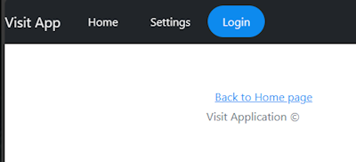  

If you click on the Login menu, and enter your credentials, you'll be connected and have access to the Visit page

After this step, the infrastructure and the services to test are ready and you can create a Microsoft Entra ID Test Tenant with users which will be used by the load testing engines.

#### Creating users in a Microsoft Entra ID test tenant 

**Creating the test tenant**

As the REST API ( HTTPS POST/GET/PUT/DELETE visit, HTTPS GET time) hosted on the backend requires and authenticated calls, we need to create temporary users in a Microsoft Entra ID test tenant.

You can get a test tenant in joining the Microsoft 365 Developer Program:
https://learn.microsoft.com/en-us/entra/identity-platform/test-setup-environment#get-a-test-tenant

**Creating users manually**

Once you get the test tenant, if you are connected to the tenant using the Tenant Administrator account, you can create manually users which will be used for the load testing scenarios:

https://learn.microsoft.com/en-us/entra/identity-platform/test-setup-environment#populate-your-tenant-with-users

You need to disable the MFA (Multi Factor Authentication) for each new user. If the MFA is not disabled, the script or the pipeline running the load testing scenario won't be able to get the Microsoft Entry ID token for the user.

The load testing script and the pipeline will use the environment variable LOAD_TESTING_USERS_CONFIGURATION to get the list of users for the load testing scenario.

The value of the variable LOAD_TESTING_USERS_CONFIGURATION is a json string with the following format:

```json
    [
      { "adu":"automationtest1@******.onmicrosoft.com",
        "pw":"*******",
        "tid":"a007455c-dcb3-****-****-***********"
      },
      .
      .
      .
    ]
```

where each user is defined with:  

- 'adu' is the user's mail adress with the following format: {TEST_USER}@{TEST_TENANT_DNS_NAME}  
- 'pw' is the user's password  
- 'tid' is the tenant Id of the test tenant  

Once the json string is fully defined, you can set the variable LOAD_TESTING_USERS_CONFIGURATION in the environment file.  
For instance, in the file ./projects/web-app-auth/configuration/.default.env:

```env
  LOAD_TESTING_USERS_CONFIGURATION='[{"adu":"automationtest@******.onmicrosoft.com","pw":"**************","tid":"a007455c-dcb3-4067-8a33-***********"}]'
```

**Creating users automatically**

You can also use the script ./scripts/create-users.sh to automatically create the automation test users.

1. From the devcontainer terminal, you can call the script create-users.sh with the following parameters:  

- '-a': action either 'create' or 'delete'  
- '-t': test tenant id  
- '-p': user name prefix, the user's email address will be {PREFIX}{INDEX}@{TEST_TENANT_DNS_NAME}   
- '-c': the number of users to create or delete  

If you are not connected to the test tenant with Azure CLI, you'll be asked to enter the login/password of the tenant Administrator.

For instance:

```bash
    vscode ➜ /workspace $ ./scripts/create-users.sh -a create -t a007455c-dcb3-4067-8a33-************ -p automationtest -c 2 
```

2. When the users are created, the script will show the value of the variable LOAD_TESTING_USERS_CONFIGURATION.
For instance:

```text
Value of the variable LOAD_TESTING_USERS_CONFIGURATION: 
'[{"adu":"automationtest1@63whhf.onmicrosoft.com","pw":"******","tid":"a007455c-dcb3-4067-8a33-************"},{"adu":"automationtest2@63whhf.onmicrosoft.com","pw":"******","tid":"a007455c-dcb3-4067-8a33-************"}]'
Creation done
```

**Deleting users automatically**

When all the tests are completed, using the same script you can also automatically delete the user accounts created for the tests. You can call the script create-users.sh with the following parameters:  

- '-a': action 'delete'  
- '-t': test tenant id   
- '-p': user name prefix, the user's email address will be {PREFIX}{INDEX}@{TEST_TENANT_DNS_NAME}   
- '-c': the number of users to delete  

For instance:

```bash
    vscode ➜ /workspace $ ./scripts/create-users.sh -a delete -t a007455c-dcb3-4067-8a33-********** -p automationtest -c 2 
```

**Granting tenant-wide admin consent**

When all the users are created in the Microsoft Entra ID tenant, you need to grant admin consent for all the users.

As you know the client ID (also known as the application ID) of the application, you can build the URL to grant tenant-wide admin consent.

The tenant-wide admin consent URL follows the following format:

```bash
    https://login.microsoftonline.com/{organization}/adminconsent?client_id={client-id}
```

where:  

- {client-id} is the application's client ID (also known as app ID).  
- {organization} is the tenant ID or any verified domain name of the tenant you want to consent the application in. 

1. Open the admin consent url using the Microsoft Entra ID Tenant admin login and password. 

2. The home page of the Web Application shoudl be displayed in your browser. Click on the 'Login' button to trigger the authentication.

   

3. If the admin constent has not been granted, you will see the dialog box below to accept the permissions for all users on behalf of your organisation. Check the box 'Consent on behalft of your organization' and click on the 'Accept' button.  

   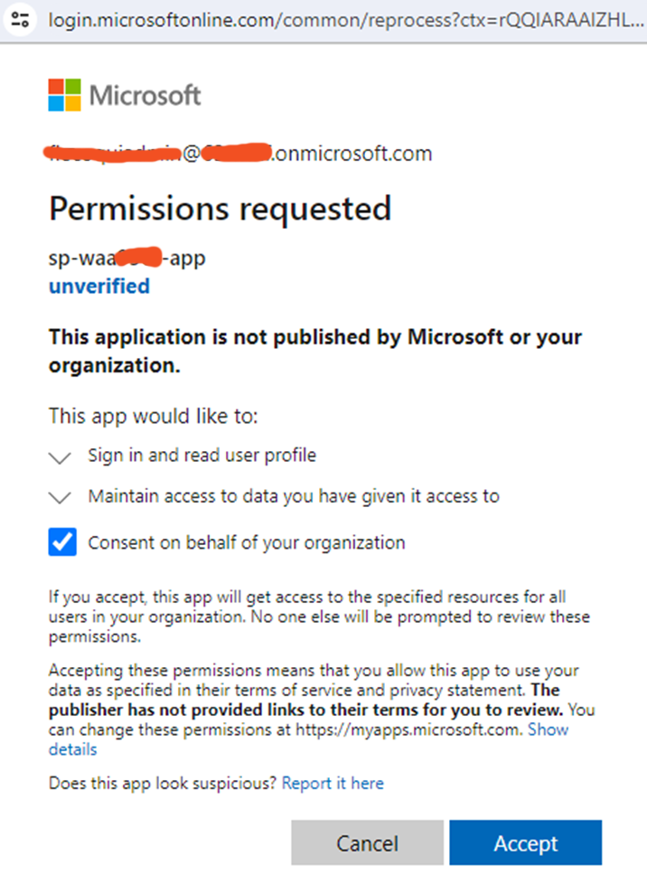

4. After this step, as the users created for the tests won't have to accept those permissions, we could use those users to run the loading tests in a automated way.

#### Deploying the load testing infrastructure

Once the infrastructure and the services are deployed, you can deploy the load testing infrastructure, using the following arguments:

```bash
    vscode ➜ /workspace $ ./projects/web-app-auth/scripts/load-testing-tool.sh  -a deploytest -c ./projects/web-app-auth/configuration/.default.env 
```

This step deploys the following resources:

- Azure Load Testing
- Azure Key vault

It assigns the following roles:

- 'Load Test Contributor' for the current user on the Load Testing scope
- 'Key Vault Secrets Officer' for the current user on the Key Vault scope
- 'Key Vault Secrets User' for the Load Testing identity on the Key Vault scope

#### Opening the access to Azure Key Vault

Once the load testing infrastructure is deployed, you need to open the access to :

- Azure Key Vault for the current user or current service principal and Azure Load Testing.

The command line below configures the network access to Azure Key Vault:

```bash
    vscode ➜ /workspace $ ./projects/web-app-auth/scripts/load-testing-tool.sh  -a opentest -c ./projects/web-app-auth/configuration/.default.env 
```

This step opens the access to Azure Key Vault.

#### Running the load test scenario

Once the Azure Key Vault are configured, you can launch the load test scenario with the following command line.

```bash
    vscode ➜ /workspace $ ./projects/web-app-auth/scripts/load-testing-tool.sh  -a runtest -c ./projects/web-app-auth/configuration/.default.env 
```

By default, the load test scenario runs with the following parameters:

- duration: 60 seconds
- Threads: 1 thread
- Engine Instances: 1
- Error trigger: 5%
- Average Response Time trigger: 100ms

You can change those parameters in editing the variables below in the configuration file, for instance: ./projects/web-app-auth/configuration/.default.env

```bash
LOAD_TESTING_DURATION=60
LOAD_TESTING_THREADS=1
LOAD_TESTING_ENGINE_INSTANCES=1
LOAD_TESTING_ERROR_PERCENTAGE=5
LOAD_TESTING_RESPONSE_TIME=100
```

This step is a journey between the different status of the Azure Load Testing Test instance:

- ACCEPTED: The load testing configuration with the JMX file and CSV files has been accepted
- PROVISIONING: The load testing service is provisioning the resources for the test
- CONFIGURING: The load testing service is configuring the resources
- EXECUTING: The load testing service is executing the test
- DONE: the test is completed

Once the test is completed, when the result status is "PASSED", the results of the test are available, and the bash file displays the results:  
For instance:  

```json
    {
      "Request for user user_1  ": {
        "transaction": "Request for user user_1  ",
        "sampleCount": 280,
        "errorCount": 0,
        "errorPct": 0,
        "meanResTime": 38.371428571428574,
        "medianResTime": 34,
        "maxResTime": 281,
        "minResTime": 22,
        "pct1ResTime": 52,
        "pct2ResTime": 58,
        "pct3ResTime": 85,
        "throughput": 4.67,
        "receivedKBytesPerSec": 0,
        "sentKBytesPerSec": 0
      },
      "Request for user user_2  ": {
        "transaction": "Request for user user_2  ",
        "sampleCount": 279,
        "errorCount": 0,
        "errorPct": 0,
        "meanResTime": 42.06810035842294,
        "medianResTime": 35,
        "maxResTime": 991,
        "minResTime": 23,
        "pct1ResTime": 54,
        "pct2ResTime": 61,
        "pct3ResTime": 103,
        "throughput": 4.73,
        "receivedKBytesPerSec": 0,
        "sentKBytesPerSec": 0
      },
      "Total": {
        "transaction": "Total",
        "sampleCount": 1396,
        "errorCount": 0,
        "errorPct": 0,
        "meanResTime": 41.00787965616046,
        "medianResTime": 35,
        "maxResTime": 991,
        "minResTime": 22,
        "pct1ResTime": 54,
        "pct2ResTime": 63,
        "pct3ResTime": 151,
        "throughput": 23.27,
        "receivedKBytesPerSec": 0,
        "sentKBytesPerSec": 0
      }
    }
```

For this step, the bash file uses curl commands to call the Azure Load Testing Data Plane REST API defined [here](https://learn.microsoft.com/en-us/rest/api/loadtesting/) to create, configure, run and monitor the load test.

#### Closing the access to Azure Key Vault

If you don't want to run any new load test, you can close the access to Azure Key Vault, with the following command line:

```bash
    vscode ➜ /workspace $ ./projects/web-app-auth/scripts/load-testing-tool.sh  -a closetest -c ./projects/web-app-auth/configuration/.default.env 
```

#### Undeploying the load testing infrastructure

You can also undeploy the load testing infrastructure with the following command:

```bash
    vscode ➜ /workspace $ ./projects/web-app-auth/scripts/load-testing-tool.sh  -a undeploytest -c ./projects/web-app-auth/configuration/.default.env 
```

#### Undeploying the infrastructure

Once the load testing infrastructure is undeployed, you can undeploy the infrastructure using load-testing-tool.sh with action 'undeploy'.
For instance the following command:

```bash
    vscode ➜ /workspace $ ./projects/web-app-auth/scripts/load-testing-tool.sh  -a undeploy -c ./projects/web-app-auth/configuration/.default.env 
```

## Using Azure DevOps pipelines and Github Actions

In this chapter, you will use Azure DevOps pipeline and/or Github Action to automate the deployment of the infrastructure and the launch of the load test.  

The pipelines (Azure DevOps pipelines and Github Actions) running Multi-Tenant load testing includes the following steps:

- deploy the infrastructure to test
- deploy the load testing infrastructure
- update the infrastructure for the load test
- run the load testing
- update the infrastructure after the load test
- publish the load testing results  

### Creating the Service Principal for Github Action and Azure DevOps pipelines Azure Authentication  

If you want to use Azure DevOps pipelines or Github Actions, an authentication with Azure using a Service Principal is required.

In order to create this service principal you can use the following bash file: [scripts/create-rbac-sp.sh](../../scripts/create-rbac-sp.sh)

This bash file assigns the role "Load Test Contributor" to the service principal, this role is mandatory to deploy and run Azure Load Testing from an Azure DevOps pipeline or a Github Action.  
It also assigns the role "Contributor" to the service principal on the current Azure subscription scope.
At least, it will create the custom role "Role Assignments Operator" with the following actions:

- Microsoft.Authorization/roleAssignments/read 
- Microsoft.Authorization/roleAssignments/write 
This role will allow the service principal to assign role for the current Azure subscription.

Before running this bash file you need to be connected with your Azure Account using Azure CLI. Run 'az login' in your linux environment or in your Dev Container Terminal

```bash
    vscode ➜ /workspace $ az login
```

Once you are connected with Azure, you can run the following bash to create the Service Principal:

```bash
    vscode ➜ /workspace $ ./scripts/create-rbac-sp.sh -s <Azure-Subscription-Id> -a <Service-Principal-Name>
```

where \<Azure-Subscription-Id\> is the subscriptionId of your Azure Account and \<Service-Principal-Name\> the name of the service principal which is created.  
Once completed, this bash file displays the information required for the Azure authentication with GitHub Action and Azure DevOps pipeline.

For instance:

```bash
    vscode ➜ /workspace $ ./scripts/create-rbac-sp.sh -s d3814ade-afe8-4260-9b5f-************ -a sp-loadtest-01
```

The bash file displays the following information in Json format:

```bash
    {
    "clientId": "********-****-****-****-************",
    "clientSecret": "************",
    "subscriptionId": "********-****-****-****-************",
    "tenantId": "********-****-****-****-************",
    "activeDirectoryEndpointUrl": "https://login.microsoftonline.com",
    "resourceManagerEndpointUrl": "https://management.azure.com/",
    "activeDirectoryGraphResourceId": "https://graph.windows.net/",
    "sqlManagementEndpointUrl": "https://management.core.windows.net:8443/",
    "galleryEndpointUrl": "https://gallery.azure.com/",
    "managementEndpointUrl": "https://management.core.windows.net/"
    }
```

In the subsequent chapter, you'll see how to use this Json string to create the Github Action Secret AZURE_CREDENTIALS and how to use the clientId and clientSecret values to create the Azure DevOps Service Connection.

The creation of this service principal with your Azure Account may fail with the following error: "insufficient privileges to complete the operation". Usually this error occurs when assigning the role 'Contributor' or creating the Custom Role, but in that case the service principal has been created without the required roles.
In that case, you have two options:  

- either you contact your Microsoft Entra ID Administrator to create the Service Principal for you,  
- or you use the minimal service principal. With this service principal, the pipeline won't be able to run all the pipeline steps. For instance, the steps which creates the Application in Microsoft Entra ID Tenant will probably fail. It may be possible to create the Application in Microsoft Entra ID Tenant manually.  
You'll find further information in the [Troubleshooting](#troubleshooting) section.

### Azure DevOps pipeline

The service principal for the Azure DevOps pipeline has been created, you can use Azure DevOps to create load testing pipelines.

The diagram below describes the architecture for this test with with Azure DevOps:

- a resource group associated with the Event Hubs based infrastructure to test
- a resource group associated with the load testing infrastructure and the VNET
- the Azure DevOps resources repository, pipeline and artifact

  

*Download a [SVG file](./docs/img/load-testing-web-app-auth/architecture-scenario-load-testing-azdo.svg) of this diagram.*

#### **Link your Azure DevOps project with the GitHub repository**
<!-- markdown-link-check-disable -->
1. Navigate on your Azure DevOps organization "https://dev.azure.com/YOUR_ORG"

    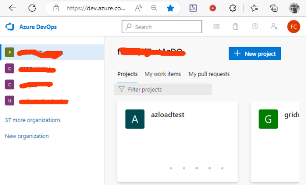
<!-- markdown-link-check-enable -->
2. Click on the button '+ New project'

3. On the 'Create new project' page enter the name of your project and click on the button 'Create'

    

4. On the main page of your project on Azure DevOps portal, select 'Repos' -> 'Files' page.

    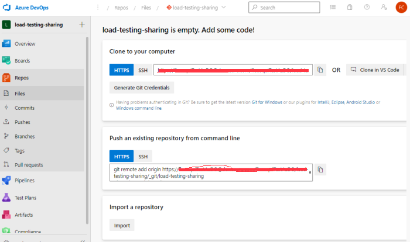

5. On this page, click on the 'import' button in the'Import a repository' section.

6. On the Import a Git repository page, enter the url of the git repository where you stored the source code of this project.

    

7. Click on the button 'Import', after few seconds the repository is imported.

    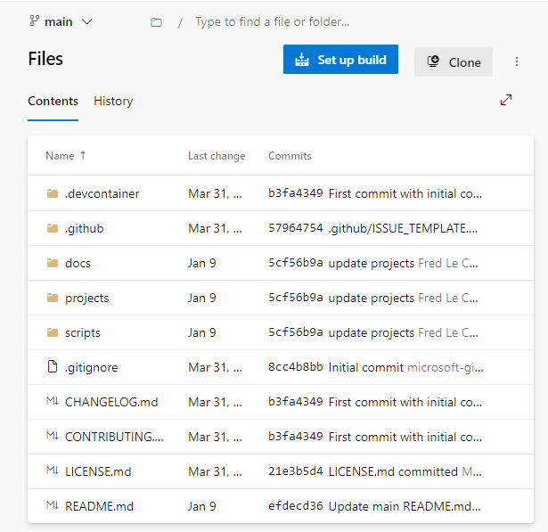

#### **Install Azure Load Testing from the Azure DevOps Market Place**

As the new pipeline runs Azure Load Testing, you need to install the Azure Load Testing for Azure DevOps.

1. Click on the Market Place icon to browse the market place  
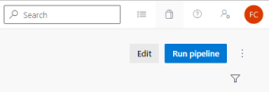

2. Search for the Azure Load Testing component  
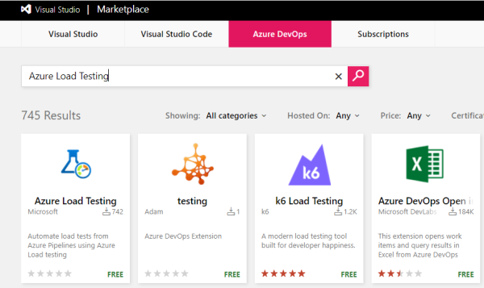

3. On the Azure Load Testing page click on the button "Get it Free"  


4. On the Market Place page click on the button "Install"  


5. After few seconds the component is installed, Go back to Azure DevOps portal clicking on button "Proceed to organization"  
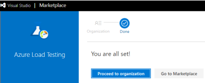

You can now create the service connection for the authentication with your Azure Account, the Variable Group and the Azure DevOps pipeline.

#### **Create Azure DevOps Service Connection, Variable Group and pipeline**

In order to create the service connection, Variable Group and pipeline you can use the following bash file: [scripts/create-azdo-resources.sh](../../projects/web-app-auth/scripts/create-azdo-resources.sh)  
This bash file creates:

- the service connection for the authentication with Azure Subscription. The name of this service connection is the name of the service principal created in the previous step with the prefix "sc-".
- the variable group which contains the parameters of the pipeline like AZURE_TEST_SUFFIX, AZURE_REGION, SERVICE_CONNECTION. By default the name of this variable group is "load-testing-vg". If you want to change this name, you'll have to update the file [scripts/create-azdo-resources.sh](../../projects/web-app-auth/scripts/create-azdo-resources.sh) and the pipeline file [azure-pipelines-load-testing.yml](./devops-pipelines/azure-pipelines/azure-pipelines-load-testing.yml).
- the Azure DevOps pipeline to run the load testing. By default, the name of the pipeline is "Load-Testing-EventHubs". If you want to change this name, you'll have to update the file [scripts/create-azdo-resources.sh](./scripts/create-azdo-resources.sh).
By default, the pipeline file should be present in the "main" branch, if it's not the case, you also need to update the file [scripts/create-azdo-resources.sh](./scripts/create-azdo-resources.sh).
  
Before running this bash file you need to be connected with your Azure Account using Azure CLI. Run 'az login' in your linux environment or in your Dev Container Terminal

```bash
    vscode ➜ /workspace $ az login
```

Once you are connected with Azure, you can run the following bash to create the Service Principal:

```bash
    vscode ➜ /workspace $ ./projects/web-app-auth/scripts/create-azdo-resources.sh -o "<MyORG>" -p "<MyProject>" -y "<MyRepository>" -s "<Azure-Subscription-Id>"  -t "<Azure-Tenant-Id>" -i "<ServicePrincipalId>" -k "<ServicePrincipalKey>"
```

where:

- \<MyORG\> is the name of your DevOps organization,
- \<MyProject\> is the name of your project,
- \<MyRepository\> is the name of your repository where the pipeline is stored,
- \<Azure-Subscription-Id\> is the subscriptionId of your Azure Account,
- \<Azure-Tenant-Id\> is the Tenant Id of your Azure AD Tenant,
- \<ServicePrincipalId\> is the value "clientId" of your Service Principal created with the bash file [scripts/create-rbac-sp.sh](../../scripts/create-rbac-sp.sh),
- \<ServicePrincipalKey\> is the value "clientSecret" of your Service Principal created with the bash file [scripts/create-rbac-sp.sh](../../scripts/create-rbac-sp.sh),

For instance:

```bash
        vscode ➜ /workspace $ ./projects/web-app-auth/scripts/create-azdo-resources.sh -o "TestAzDO" -p "load-testing-sharing" -y "load-testing-restricted-public-access" -s "d3814ade-afe8-4260-9b5f-xxxxxxxxxxxx"  -t "6a13df32-a807-43c4-8277-xxxxxxxxxxxx" -i "1d736738-9c5f-4de7-84f9-xxxxxxxxxxxx" -k "ok-8Q~Rsxxxxxxxxxxxx"
```

Once completed, this bash file displays the information about the different resources created.

```bash
  Creating Service Connection for:
    Subscription: d3814ade-afe8-4260-9b5f-xxxxxxxxxxxx
    Tenant: 6a13df32-a807-43c4-8277-xxxxxxxxxxxx
    Service Principal Id: 1d736738-9c5f-4de7-84f9-xxxxxxxxxxxx
  Creating Service Connection...
  Updating Service Connection to allow all pipelines...
  Creating Variables Group 'load-testing-vg' for:
    Organization: 'https://dev.azure.com/TestAzDO/'
    Project: 'load-testing-sharing'
  Creating Variables Group...
  Creating Pipeline 'Load-Testing-EventHubs' for:
    Organization: 'https://dev.azure.com/TestAzDO/'
    Project: 'load-testing-sharing'
  Creating Pipeline...
  Pipeline 'Load-Testing-EventHubs' created.
```

**WARNING:**  
If the Microsoft Entra ID Tenant for the Azure Subscription and the Microsoft Entra ID Tenant for Azure DevOps are different, you can't use Azure CLI login, you need to use an Azure DevOps Personal Access Token for the authentication with the Azure DevOps organization.  
In that case, you need to use the bash file create-azdo-resources.sh with a new option -n "<PATToken>":  

```bash
    vscode ➜ /workspace $ ./projects/web-app-auth/scripts/create-azdo-resources.sh -o "<MyORG>" -p "<MyProject>" -y "<MyRepository>" -s "<Azure-Subscription-Id>"  -t "<Azure-Tenant-Id>" -i "<ServicePrincipalId>" -k "<ServicePrincipalKey>" -n "<PATToken>"
```

To create the PAT Token:
1. Open the url "https://dev.azure.com/YOUR_ORG/_usersSettings/tokens" with you Internet Browser 
2. Click on the link "+ New Token".
3. On the Dialog Box 'Create a new personal access token', enter the name of the token, select Read/Write/Execute permissions for all the scopes (WorkItems, Code, Build, ...)
4. Click on the button 'Create'
5. Copy the PAT Token and run the script create-azdo-resources.sh with the PAT Token. 

For instance:

```bash
        vscode ➜ /workspace $ ./projects/web-app-auth/scripts/create-azdo-resources.sh -o "TestAzDO" -p "load-testing-sharing" -y "load-testing-restricted-public-access" -s "d3814ade-afe8-4260-9b5f-xxxxxxxxxxxx"  -t "6a13df32-a807-43c4-8277-xxxxxxxxxxxx" -i "1d736738-9c5f-4de7-84f9-xxxxxxxxxxxx" -k "ok-8Q~Rsxxxxxxxxxxxx"  -n "pK8Q****Q3"
```


You can now check whether the service connection, the variable group and pipeline have been created.

1. On the main page of your project on Azure DevOps portal, select 'Project Settings' -> 'Service Connections' page. You should see the new service  connection with the prefix "sc-".  

    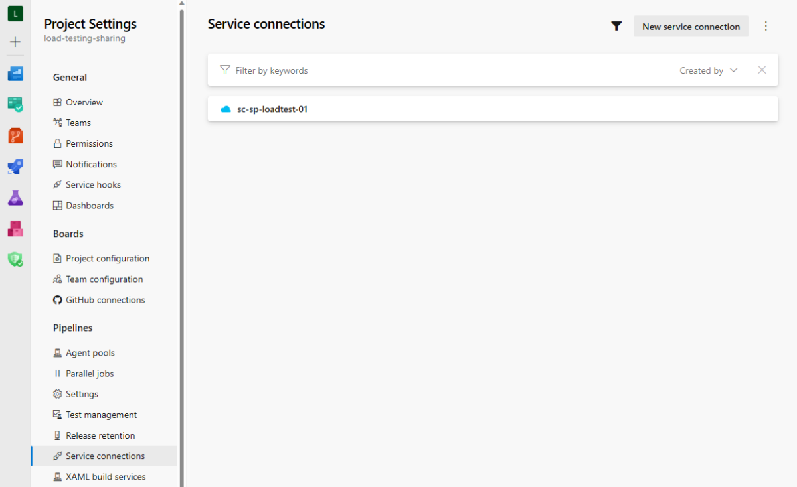

2. On the main page of your project on Azure DevOps portal, select 'Pipelines' -> 'Library' page. You should see the new variable group "load-testing-web-app-auth-vg".  

    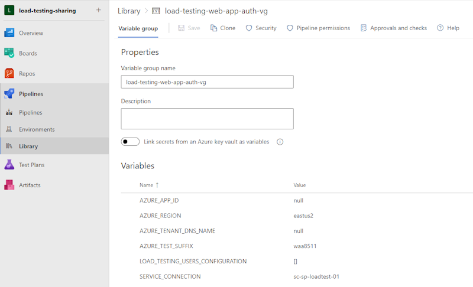

3. The variables AZURE_REGION, AZURE_TEST_SUFFIX and SERVICE_CONNECTION should be already correctly set. The variables AZURE_APP_ID and AZURE_TENANT_DNS_NAME should be set to 'null', the pipeline will automatically initialize those variables when creating the Application in Microsoft Entra ID Tenant. 

4. The variable LOAD_TESTING_USERS_CONFIGURATION must be initialized with the JSON string which contains the list of user in the Microsoft Entra ID Test Tenant. This list of users can be created with the bash script: './scripts/create-users.sh'

```text
'[{"adu":"automationtest1@63whhf.onmicrosoft.com","pw":"******","tid":"a007455c-dcb3-4067-8a33-************"},........{"adu":"automationtest5@63whhf.onmicrosoft.com","pw":"******","tid":"a007455c-dcb3-4067-8a33-************"}]'
```
    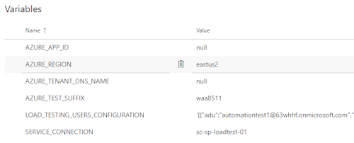

5. On the main page of your project on Azure DevOps portal, select 'Pipelines' -> 'Pipelines' page. You should see the new pipeline "Load-Testing-EventHubs".  

    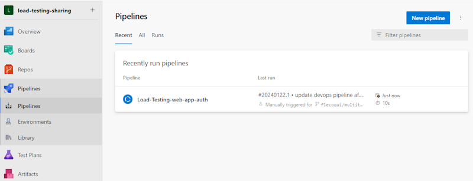

6. You can now click on the "Run pipeline" button to run manually the pipeline.
7. On the dialog box 'Run pipeline',  
    - select the 'main' branch,  
    - select the Azure App Service Sku "B1", "B2", "B3", "S1", "S2", "S3",... ("B1" by default),  
    - enter the duration of the test in seconds (60 seconds by default),  
    - enter the number of threads for the load testing (1 by default),  
    - enter the number of engine instances for the load testing (1 by default),  
    - enter the error percentage threshold for the load testing (5 by default),  
    - enter the average response time in milliseconds threshold for the load testing (100 by default),  
  Then click on the button "Run"

    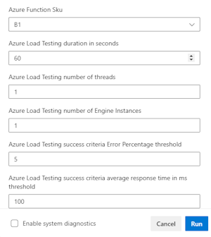

8. The pipeline will first deploy the infrastructure to test, create the application and deploy the services. When you run the pipeline for the first time, the Microsoft Entra test tenant admin must explicitly grant consent for the requested permissions to the multi-tenant application. The tenant administrator can open the following url:

```bash
    https://login.microsoftonline.com/{organization}/adminconsent?client_id={client-id}
```
where:  
    - {client-id} is the application's client ID (also known as application ID).  
    - {organization} is the tenant ID or any verified domain name of the tenant you want to consent the application in.

The browser will automatically open the url of the frontend hosted on the Azure Static Web App. Click on the 'Login' button. 

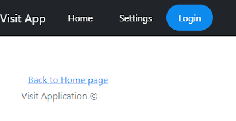

9. Enter the login password of the Microsoft Entra Test Tenant administrator, the following page will be displayed  to grant consent for the requested permissions on behalf of the organization. 

    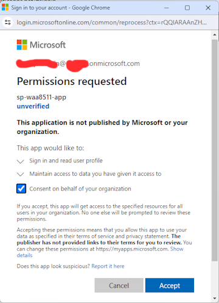

10. After few minutes, the pipeline is completed and you can download and visualize the results on the Azure Portal.

    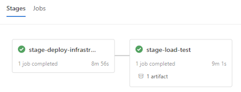

11. On the Azure Load Testing result page, you can see the requests/sec and the response time for the Event Hubs REST API requests towards both Event Hub inputs.

    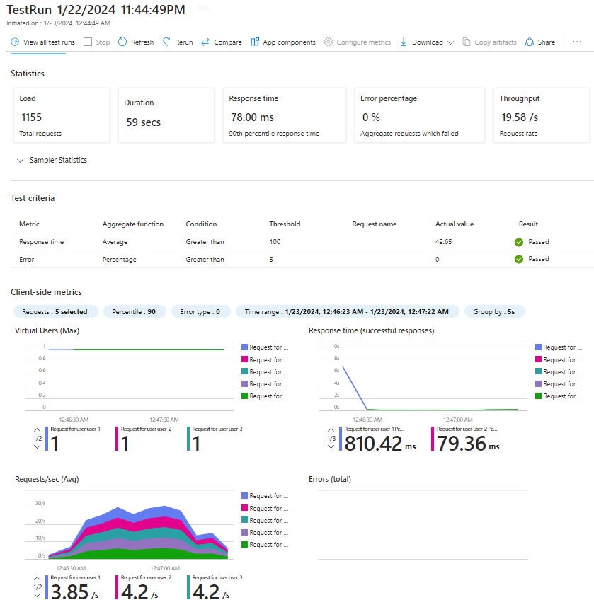


### Github Action

You can also use Github Action to automate the load testing of the same infrastructure based on Azure Event Hubs:

The diagram below describes the architecture for this test with Github Action:

- a resource group associated with the Event Hubs based infrastructure to test  
- a resource group associated with the load testing infrastructure and the Virtual Network  
- the Github resources repository, Github Action and artifact  
  
  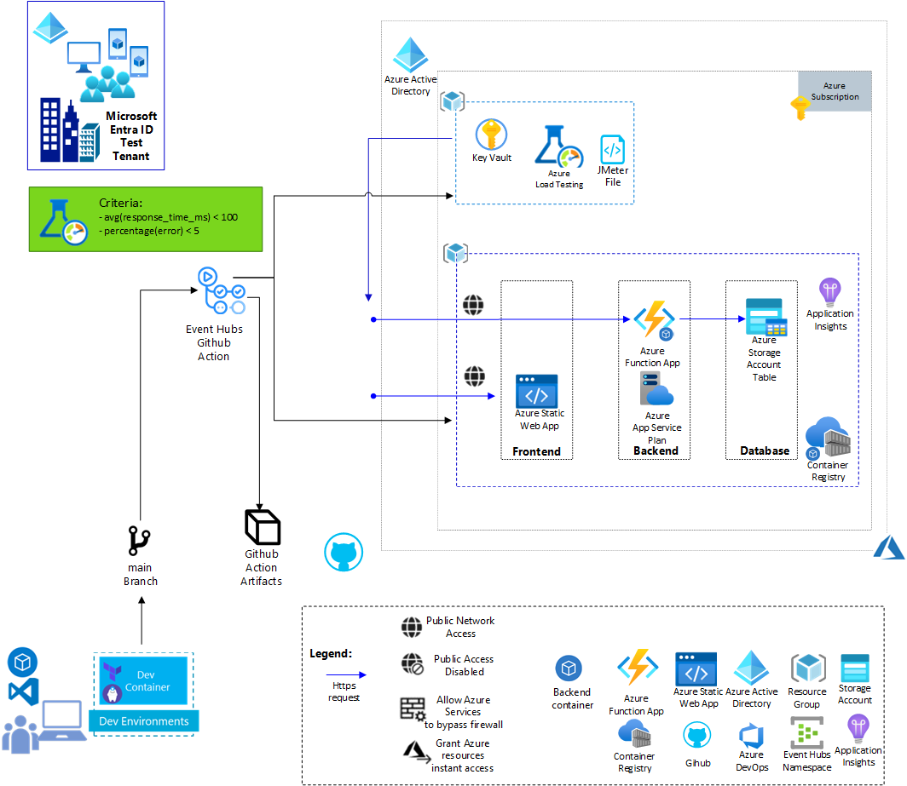

*Download a [SVG file](./docs/img/load-testing-web-app-auth/architecture-scenario-load-testing-github-action.svg) of this diagram.*

First, you need to create the Github Action Secret AZURE_CREDENTIALS for the authentication with Azure.

#### **Create Github Action Secret AZURE_CREDENTIALS**

1. On the GitHub portal where you store your project, navigate on the the page 'Settings' and select the submenu 'Actions' in the menu 'Secrets and variables' and select the tab 'Secrets' on the page 'Actions secrets and variables'.

    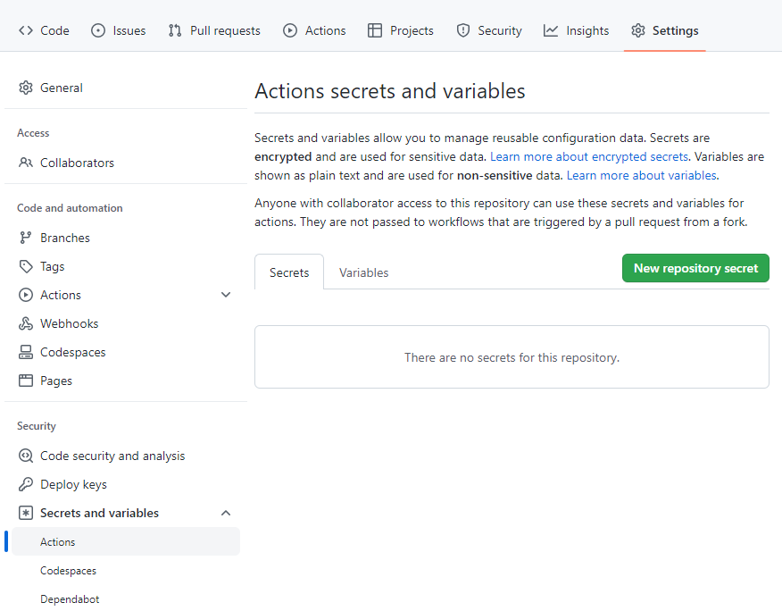

2. Click on 'New repository secret' button, enter 'AZURE_CREDENTIALS' in the Name field and copy/paste the JSON value associated with the service principal created with create-rbac-sp.sh.

    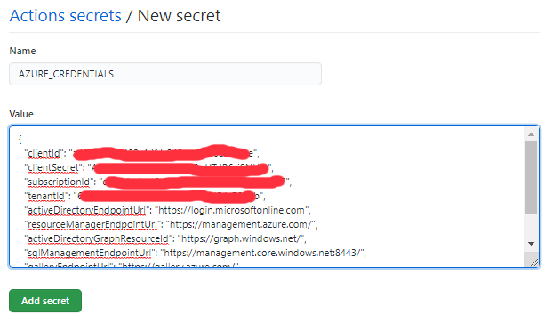

3. Click on 'Add secret' button. The new secret will be accessible on the Secret page.  

    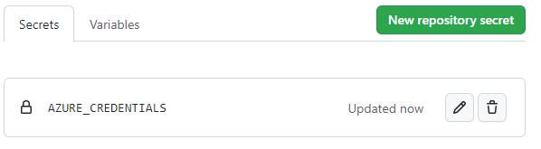

#### **Create Github Action configuration variables**

Before installing the Github Action, you need to create the configuration variables which will be used by the Github Action:

- AZURE_REGION: The Azure region where the service will be deployed, for instance: 'eastus2'
- AZURE_TEST_SUFFIX: The suffix which it used to give a name to all the Azure resources.

When you enter the value of AZURE_TEST_SUFFIX, select a value which will not generate an Azure resource name which already exists.
You can use the command line below to generate a value which will avoid any conflict with existing Azure Storage, Azure Key Vault and Azure Events Hubs:

```bash
  vscode ➜ /workspace $ ./projects/web-app-auth/scripts/load-testing-tool.sh  -a getsuffix 
```

1. On the GitHub portal page associated with your project, navigate on the the page 'Settings' and select the submenu 'Actions' in the menu 'Secrets and variables' and select the tab 'Variables' on the page 'Actions secrets and variables'.

    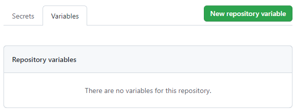

2. Click on 'New repository variable' button, enter 'AZURE_REGION' in the 'Name' field and the Azure region in the 'Value' field and click on the 'Add variable' button.

3. Click on 'New repository variable' button, enter 'AZURE_TEST_SUFFIX' in the 'Name' field and enter the suffix in the 'Value' field and click on the 'Add variable'

4. Click on 'New repository variable' button, enter 'AZURE_APP_ID' in the 'Name' field and enter the value 'null' and click on the 'Add variable'

5. Click on 'New repository variable' button, enter 'AZURE_TENANT_DNS_NAME' in the 'Name' field and enter the value 'null' and click on the 'Add variable'

    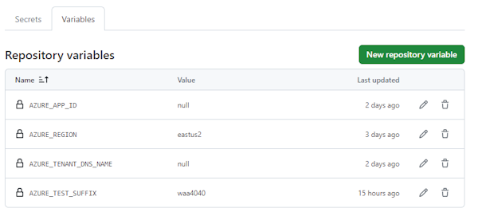

#### **Create Github Action pipeline for Event Hubs with restricted public access Load Testing**

By default, all the Github Action pipelines are stored under 'devops-pipelines/github-action'.
The Load Testing Github Action pipeline is [github-action-load-testing.yml](devops-pipelines/github-action/github-action-load-testing.yml)

In order to activate this pipeline, follow the steps below:

1. Create a folder '.github/workflows' in your repository
2. Copy the file ./projects/web-app-auth/devops-pipelines/github-action/github-action-load-testing.yml  in the folder '.github/workflows'
3. Commit and push this modification in your "main" branch

    ```bash
      git add  .github/workflows/github-action-load-testing.yml
      git commit -m "Create Multi-Tenant Web App Load Testing Github Action"
      git push
    ```

4. Once the new pipeline is pushed into the main branch, you can launch manually the Github Action. On the GitHub portal, on the 'Action' page, select the workflow 'load-testing-multi-tenant-web-app' and click on the button 'Run workflow'. If required you can change the following input parameters:

   - Github branch: main by default
   - Azure Eventhub Sku: Standard by default
   - Load Testing duration: 60 seconds by default
   - Load Testing number of threads: 1 by default
   - Load Testing number of engine instances: 1 by default  
   - Load Testing error percentage threshold: 5% by default  
   - Load Testing average response time in milliseconds threshold: 100 ms by default  
   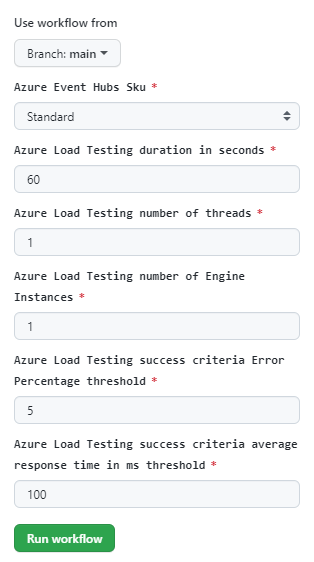

5. After few minutes, the pipeline has been completed and you can download the load testing artifacts.  

    

## Troubleshooting

### When the Application Creation step fails in the pipeline 

When you run the Load Testing pipeline, the Azure DevOps step called 'Step Get or Create ApplicationId' or Github action called 'createapp' may fail and the AZURE_APP_ID variable is not set.
The variable AZURE_APP_ID contains the AppId of the Microsoft Entra ID application associated with the Web App.  

  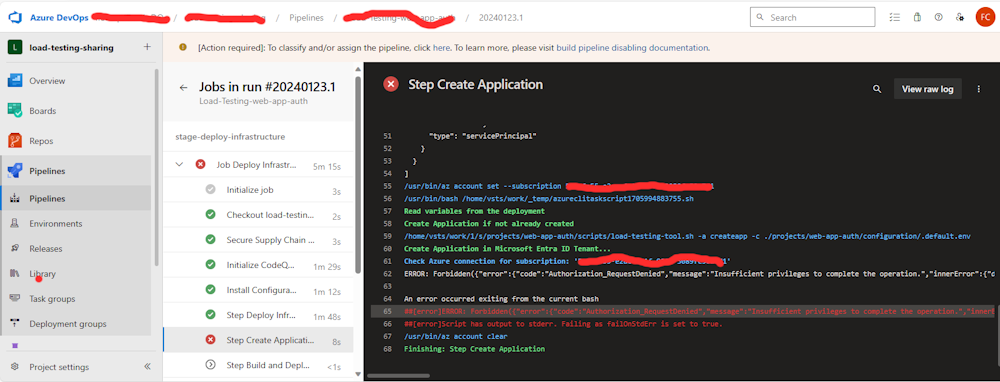

Usually this step fails if the service principal associated with the pipeline doesn't have enough privilege to create an Application.  

A possible turn around consists in creating manually the Application from the Dev Container with the bash file iactool.sh.

1. Copy the values of the variables AZURE_APP_PREFIX, AZURE_REGION in the variable group.  

    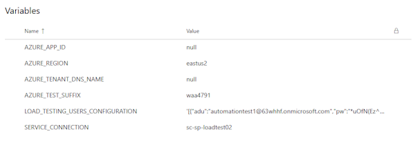

2. In Visual Studio Code update the file ./configuration/.default.env and add or update the following variables:

    ```bash
    AZURE_REGION=eastus2
    AZURE_APP_PREFIX=waa1908
    AZURE_SUBSCRIPTION_ID=
    AZURE_TENANT_ID=
    ```

    Set the variables AZURE_APP_PREFIX, AZURE_REGION with the values in the variables group.
    Set the variable AZURE_SUBSCRIPTION_ID with the SubscriptionId of your Azure Subscription.
    Set the variable AZURE_TENANT_ID with the TenantId of your Azure Tenant.

    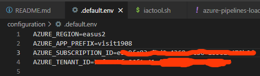

3. Once the file ./configuration/.default.env is updated, you can run the following command from the Dev Container:

    ```bash
        ./devops-pipelines/utils/iactool.sh -a createapp -c ./configuration/.default.env
    ```

    This command will create the Application and display the appId of the new application:

    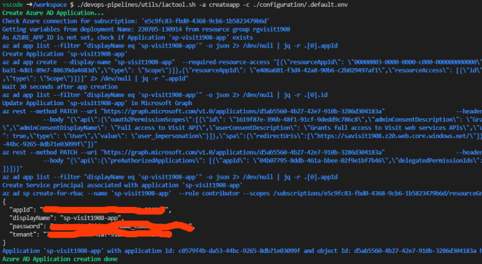

    **Note**:
    The creation of the Application in Microsoft Entra ID Tenant requires a redirect uri which is known once the infrastructure is deployed. This redirect Uri is a uri to an Azure Static Web App hosting the frontend. The creation of the Application in Microsoft Entra ID Tenant must be launched once the infrastructure is deployed. If you launch the creation of the Application in Microsoft Entra ID Tenant before deploying the infrastructure it will fail.

4. Copy the value of the appId in a new variable in the variable group called 'AZURE_APP_ID'

    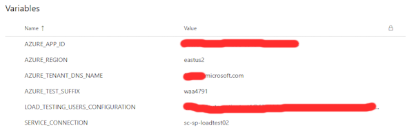

5. Run the Web App Load Testing pipeline with the variable 'AZURE_APP_ID' defined in the variable group. If this variable is defined, the step 'Step Get or Create ApplicationId' will not try to create an application and will use AZURE_APP_ID value as the value of the Application.

## Under the hood

### Creating the custom role associated with the Service Princpal

The service principal used to run the load testing pipeline is associated with a custom role called 'Role Assignments Operator'. This role allows the service principal to assign role.
The script [scripts/create-rbac-sp.sh](../../scripts/create-rbac-sp.sh) is used to create this custom role with Azure CLI.
Once the role 'Role Assignments Operator' is created, it's assigned to the service principal with a scope associated with the Azure subscription.
Oftentimes this assignment failed with the error "Custom Role doesn't exist", though the custom role was created during the previous step (az role assignment create).
When you run the command line "az role definition list" check whether the custom role exists is acutally not consistent during several minutes:
If you launch several times the command line below ater the creation of your custom role, it will never return the same result. Sometimes the custom role is not found, sometimes the role is found. The result is consistent after several minutes.

```bash
      az role definition list --custom-role-only true --name "$2" --scope "/subscriptions/$1" | jq -r '[.[]|select(.roleType=="CustomRole"and.roleName=="$2")][0].roleName'

```

The turnaround consists in testing the existence of the custom role several times, if the custom role is detected or nor detected 'N' times in a row, we can consider the role as created or not present. Following sveral tests, when 'N=10', the custom role creation and assignment is successful.

Below the function used to check whether the custom role exists or not.

```bash
    #######################################################
    #- get Custom Role confirmed existence
    # $1 = Subscription
    # $2 = Custom Role Name
    # $3 = Test Counter with same result
    # $4 = Timeout in seconds 
    #######################################################
    roleExists () {
        cmd="az role definition list --custom-role-only true --name \"$2\" --scope \"/subscriptions/$1\" | jq -r '[.[]|select(.roleType==\"CustomRole\"and.roleName==\"$2\")][0].roleName'"
        local COUNTER=0
        local EXIST_COUNTER=0
        local NOT_EXIST_COUNTER=0
        while (( NOT_EXIST_COUNTER < $3 && EXIST_COUNTER < $3 && COUNTER < $4 ));
        do
            ROLE=$(eval "${cmd}")
            if [ "${ROLE}" == "$2" ]; then
                NOT_EXIST_COUNTER=0
                ((EXIST_COUNTER=EXIST_COUNTER+1))    
            else
                EXIST_COUNTER=0
                ((NOT_EXIST_COUNTER=NOT_EXIST_COUNTER+1)) 
            fi
            sleep 1
            ((COUNTER=COUNTER+1))
            # echo "$COUNTER $EXIST_COUNTER $NOT_EXIST_COUNTER"
        done   
        if (( EXIST_COUNTER >= $3 )); then
            echo "true"
        else
            if (( NOT_EXIST_COUNTER >= $3 )); then
                echo "false"
            else
                if (( NOT_EXIST_COUNTER >= EXIST_COUNTER  )); then
                    echo "false"
                fi
            fi
        fi
    }
```

Below the shell script to create and assign the custom role:

```bash
    CUSTOM_ROLE_NAME="Role Assignments Operator"
    verboseMessage "Assign custom role \"${CUSTOM_ROLE_NAME}\" to service principal"
    verboseMessage "Checking if custom role \"${CUSTOM_ROLE_NAME}\" exists wait up-to 600 seconds"
    if [ $(roleExists "${subscription}" "${CUSTOM_ROLE_NAME}" "10" "600") == "false" ]; then
        TEMPDIR=$(mktemp -d)
        cat > "${TEMPDIR}/role.json" << EOF
    {
        "Name": "${CUSTOM_ROLE_NAME}",
        "IsCustom": true,
        "Description": "Can assign roles.",
        "Actions": [
            "Microsoft.Authorization/roleAssignments/write",
            "Microsoft.Authorization/roleAssignments/read"
        ],
        "NotActions": [
        ],
        "AssignableScopes": [
            "/subscriptions/${subscription}"
        ]
    }
    EOF
        verboseMessage "Creating custom role \"${CUSTOM_ROLE_NAME}\""
        cmd="az role definition create --role-definition \"${TEMPDIR}/role.json\""
        eval "${cmd}" 1> /dev/null
        verboseMessage "Waiting 60 seconds before assigning the role: '${CUSTOM_ROLE_NAME}'" 
        sleep 60  
    else
        verboseMessage "Custom role \"${CUSTOM_ROLE_NAME}\" already exists"
    fi

    verboseMessage "Checking if custom role \"${CUSTOM_ROLE_NAME}\" exists wait up-to 600 seconds"
    if [ $(roleExists "${subscription}" "${CUSTOM_ROLE_NAME}" "10" "600") == "true" ]; then
        verboseMessage "Assigning custom role \"${CUSTOM_ROLE_NAME}\" to service principal"    
        cmd="az role assignment create --assignee \"${appId}\"  --role \"${CUSTOM_ROLE_NAME}\"  --scope \"/subscriptions/${subscription}\" --only-show-errors"
        # echo "${cmd}"
        eval "${cmd}" 1> /dev/null 
    else
        errorMessage "Custom role '${CUSTOM_ROLE_NAME}' not created"
        exit 1
    fi
```

### Creating the load testing pipeline task configuration file (yml file)

When you want to run the load testing scenario from a pipeline (Github Action or Azure DevOps), you need to prepare a YAML configuration file which will be used to configure the load testing step.

This configuration file must contain for each test user the reference to the secret in Azure Key Vault where the Microsoft Entra ID token will be stored.
As the number of users is not known in advance, the YAML configuration file will be created from a YAML template file with a "variable" called '{azureADTokens}'.
The YAML template below:

```yaml
    ---
    version: v0.1
    testName: load-testing-web-app-auth-multi-users
    testPlan: load-testing.jmx
    description: 'load-testing-web-app-auth-multi-users Test Run'
    engineInstances: "{engineInstances}"

    failureCriteria:
        - "avg(response_time_ms) > {responseTimeMs}"
        - "percentage(error) > {errorPercentage}"
    secrets:
    {azureADTokens}
```

A bash script will replace all the variables in the YAML template file with their respectives values, see the code below:

```bash
      cp "$(System.DefaultWorkingDirectory)/projects/web-app-auth/scenarios/web-app-auth-multi-users/load-testing.template.yaml" "$TEMP_DIR/load-testing.yaml"
      sed -i "s/{engineInstances}/${{ parameters.engineInstances }}/g" "$TEMP_DIR/load-testing.yaml"
      sed -i "s/{errorPercentage}/${{ parameters.errorPercentage }}/g" "$TEMP_DIR/load-testing.yaml"
      sed -i "s/{responseTimeMs}/${{ parameters.responseTimeMs }}/g" "$TEMP_DIR/load-testing.yaml"

      COUNTER=1
      AZURE_AD_TOKENS=""
      while read item; do     
          ITEM="    - name: \"{loadTestSecretName}_${COUNTER}\"
            value: \"https://{keyVaultName}.vault.azure.net/secrets/{keyVaultSecretName}-${COUNTER}/\""
          # echo ITEM: "${ITEM}"
          if [[ COUNTER -eq 1 ]]; then
              AZURE_AD_TOKENS="${ITEM}"
          else
              AZURE_AD_TOKENS="${AZURE_AD_TOKENS}
      ${ITEM}"
          fi
          (( COUNTER++ ))
      done <<< $(echo "${LOAD_TESTING_USERS_CONFIGURATION}" | jq -c -r ".[]" ); 
      
      echo AZURE_AD_TOKENS: "${AZURE_AD_TOKENS}"
      AZURE_AD_TOKENS_ESCAPE=$(echo "${AZURE_AD_TOKENS}" | sed -e 's/\\/\\\\/g; s/\//\\\//g; s/&/\\\&/g' |  sed '$!s@$@\\@g')
      echo AZURE_AD_TOKENS_ESCAPE: "${AZURE_AD_TOKENS_ESCAPE}"
      sed -i "s/{azureADTokens}/${AZURE_AD_TOKENS_ESCAPE}/g" "$TEMP_DIR/load-testing.yaml"
      sed -i "s/{loadTestSecretName}/token/g" "$TEMP_DIR/load-testing.yaml"
      sed -i "s/{keyVaultName}/${LOAD_TESTING_KEY_VAULT_NAME}/g" "$TEMP_DIR/load-testing.yaml"
      sed -i "s/{keyVaultSecretName}/${LOAD_TESTING_SECRET_NAME}/g" "$TEMP_DIR/load-testing.yaml"

      echo "load-testing.yaml content:"
      cat "$TEMP_DIR/load-testing.yaml"

```

And the new YAML configuration is created with the expected values:

```yaml
    ---
    version: v0.1
    testName: load-testing-web-app-auth-multi-users
    testPlan: load-testing.jmx
    description: 'load-testing-web-app-auth-multi-users Test Run'
    engineInstances: "1"

    failureCriteria:
        - "avg(response_time_ms) > 100"
        - "percentage(error) > 5"
    secrets:
        - name: "token_1"
          value: "https://kvwaa8593.vault.azure.net/secrets/AD-TOKEN-1/"
        - name: "token_2"
          value: "https://kvwaa8593.vault.azure.net/secrets/AD-TOKEN-2/"
        - name: "token_3"
          value: "https://kvwaa8593.vault.azure.net/secrets/AD-TOKEN-3/"
        - name: "token_4"
          value: "https://kvwaa8593.vault.azure.net/secrets/AD-TOKEN-4/"
        - name: "token_5"
          value: "https://kvwaa8593.vault.azure.net/secrets/AD-TOKEN-5/"
```

### Creating the load testing json files

When we run the load testing process from the Dev Container, we can't use the YAML configuration file used to configure the load testing pipeline task. Instead we use two different json templates. From those json templates, two json files will be generated and used to call the Load Testing REST API.
It's the same template approach for the json files associated with the load testing scenario: in the repository there is a load-testing.template.json template file and a load-testing-run.template.json template file. Those two template file include the variables {users} and {azureADTokens}. The value of those 2 variables depends on the number of users.
Below the file load-testing.template.json with {users} and {azureADTokens} variables.

```json
    {
      "description": "{name} Test",
      "displayName": "{name}",
      "loadTestConfiguration": {
        "engineInstances": "{engineInstances}",
        "splitAllCSVs": false
      },
      "passFailCriteria": {
        "passFailMetrics": {
          "fefd759d-7fe8-4f83-8b6d-aeebe0f491fe": {
            "clientMetric": "response_time_ms",
            "aggregate": "avg",
            "condition": ">",
            "value":  "{responseTimeMs}",
            "action": "continue"
          },
          "fefd759d-7fe8-4f83-8b6d-aeebe0f491ff": {
            "clientMetric": "error",
            "aggregate": "percentage",
            "condition": ">",
            "value": "{errorPercentage}",
            "action": "continue"
          }
        }
      },
      "secrets": {
        {azureADTokens}
      },
      "environmentVariables": {
        {users},
        "hostname": "{hostname}",
        "path": "{path}",    
        "duration": "{duration}",
        "threads": "{threads}"
      },
      "keyvaultReferenceIdentityType": "SystemAssigned"
    }
```

below the bash script to create the json file used to create the load testing scenario through the Azure Load Testing REST API.

```bash
    cp  "$SCRIPTS_DIRECTORY/../../../projects/web-app-auth/scenarios/${LOAD_TESTING_SCENARIO}/load-testing.template.json"  "$TEMP_DIR/load-testing.json"
    sed -i "s/{name}/${LOAD_TESTING_TEST_NAME}/g" "$TEMP_DIR/load-testing.json"
    sed -i "s/{engineInstances}/${LOAD_TESTING_ENGINE_INSTANCES}/g" "$TEMP_DIR/load-testing.json"
    sed -i "s/{errorPercentage}/${LOAD_TESTING_ERROR_PERCENTAGE}/g" "$TEMP_DIR/load-testing.json"
    sed -i "s/{responseTimeMs}/${LOAD_TESTING_RESPONSE_TIME}/g" "$TEMP_DIR/load-testing.json"
    sed -i "s/{hostname}/$(echo ${LOAD_TESTING_TARGET_HOSTNAME} | sed -e 's/\\/\\\\/g; s/\//\\\//g; s/&/\\\&/g')/g" "$TEMP_DIR/load-testing.json"
    sed -i "s/{path}/$(echo ${LOAD_TESTING_TARGET_PATH} | sed -e 's/\\/\\\\/g; s/\//\\\//g; s/&/\\\&/g')/g" "$TEMP_DIR/load-testing.json"
    sed -i "s/{duration}/${LOAD_TESTING_DURATION}/g" "$TEMP_DIR/load-testing.json"
    sed -i "s/{threads}/${LOAD_TESTING_THREADS}/g" "$TEMP_DIR/load-testing.json"
    
    COUNTER=1
    AZURE_AD_TOKENS=""
    while read item; do     
        ITEM="\"token_${COUNTER}\":{\"value\":\"https://{keyVaultName}.vault.azure.net/secrets/{keyVaultAzureADTokenSecretName}-${COUNTER}/\",\"type\":\"AKV_SECRET_URI\"}"
        # echo "ITEM: ${ITEM}"
        if [[ COUNTER -eq 1 ]]; then
            AZURE_AD_TOKENS="${ITEM}"
        else
            AZURE_AD_TOKENS="${AZURE_AD_TOKENS},${ITEM}"
        fi
        (( COUNTER++ ))
    done <<< $(echo "${LOAD_TESTING_USERS_CONFIGURATION}" | jq -c -r ".[]" ); 
    # echo "AZURE_AD_TOKENS: ${AZURE_AD_TOKENS}"
    sed -i "s/{azureADTokens}/$(echo ${AZURE_AD_TOKENS} | sed -e 's/\\/\\\\/g; s/\//\\\//g; s/&/\\\&/g')/g" "$TEMP_DIR/load-testing.json"

    COUNTER=1
    USERS=""
    while read item; do 
        VALUE=$(jq -r '.adu' <<< "$item");
        ITEM="\"user_${COUNTER}\":\"${VALUE}\""
        # echo "ITEM: ${ITEM}"
        if [[ COUNTER -eq 1 ]]; then
            USERS="${ITEM}"
        else
            USERS="${USERS},${ITEM}"
        fi
        (( COUNTER++ ))
    done <<< $(echo "${LOAD_TESTING_USERS_CONFIGURATION}" | jq -c -r ".[]" ); 
    # echo "USERS: ${USERS}"
    sed -i "s/{users}/$(echo ${USERS} | sed -e 's/\\/\\\\/g; s/\//\\\//g; s/&/\\\&/g')/g" "$TEMP_DIR/load-testing.json"

    sed -i "s/{keyVaultName}/${LOAD_TESTING_KEY_VAULT_NAME}/g" "$TEMP_DIR/load-testing.json"
    sed -i "s/{keyVaultAzureADTokenSecretName}/${LOAD_TESTING_SECRET_NAME}/g" "$TEMP_DIR/load-testing.json"
    
```

Below the bash script which call the load testing REST API to create the new test scenario with the json file:

```bash

    cmd="curl -s -X PATCH \
    \"https://$LOAD_TESTING_HOSTNAME/tests/$LOAD_TESTING_TEST_ID?api-version=2022-11-01\" \
    -H 'accept: application/merge-patch+json'  -H 'Content-Type: application/merge-patch+json' -H 'Authorization: Bearer $LOAD_TESTING_TOKEN' \
    -d \"@$TEMP_DIR/load-testing.json\" "
    eval "$cmd" >/dev/null

```

### Creating the load testing jmx file

It's the same template approach for the jmx file associated with the load testing scenario: in the repository there is a JMX template file for each load testing scenario with variables {users} and {tokens}. The value of those 2 variables depends on the number of users used for the tests.
Below an extract of the JMX template file:  

```xml
        <Arguments guiclass="ArgumentsPanel" testclass="Arguments" testname="User Defined Variables" enabled="true">
          <collectionProp name="Arguments.arguments">
            <elementProp name="udv_hostname" elementType="Argument">
              <stringProp name="Argument.name">udv_hostname</stringProp>
              <stringProp name="Argument.value">${__BeanShell( System.getenv("hostname") )}</stringProp>
              <stringProp name="Argument.desc">API hostname</stringProp>
              <stringProp name="Argument.metadata">=</stringProp>
            </elementProp>
            <elementProp name="udv_path" elementType="Argument">
              <stringProp name="Argument.name">udv_path</stringProp>
              <stringProp name="Argument.value">${__BeanShell( System.getenv("path") )}</stringProp>
              <stringProp name="Argument.desc">API request path</stringProp>
              <stringProp name="Argument.metadata">=</stringProp>
            </elementProp>                        
            <elementProp name="udv_duration" elementType="Argument">
              <stringProp name="Argument.name">udv_duration</stringProp>
              <stringProp name="Argument.value">${__BeanShell( System.getenv("duration") )}</stringProp>
              <stringProp name="Argument.desc">Test Duration</stringProp>
              <stringProp name="Argument.metadata">=</stringProp>
            </elementProp>
            <elementProp name="udv_threads" elementType="Argument">
              <stringProp name="Argument.name">udv_threads</stringProp>
              <stringProp name="Argument.value">${__BeanShell( System.getenv("threads") )}</stringProp>
              <stringProp name="Argument.desc">Test number of threads</stringProp>
              <stringProp name="Argument.metadata">=</stringProp>
            </elementProp>                         
            {users}
            {tokens}                                                                                 
          </collectionProp>
        </Arguments>

```

Below the bash script used to generate the JMX file for the test:

```bash
      printMessage "Preparing load-testing.jmx for test ${LOAD_TESTING_TEST_NAME}..." 
      cp "$(System.DefaultWorkingDirectory)/projects/web-app-auth/scenarios/web-app-auth-multi-users/load-testing.template.jmx" "$TEMP_DIR/load-testing.jmx"
      COUNTER=1
      AZURE_AD_TOKENS=""
      while read item; do     
          ITEM="<elementProp name=\"udv_token_${COUNTER}\" elementType=\"Argument\"><stringProp name=\"Argument.name\">udv_token_${COUNTER}</stringProp><stringProp name=\"Argument.value\">\${__GetSecret(token_${COUNTER})}</stringProp><stringProp name=\"Argument.desc\">Azure AD or SAS Token Token ${COUNTER}</stringProp><stringProp name=\"Argument.metadata\">=</stringProp></elementProp>"
          if [[ COUNTER -eq 1 ]]; then
              AZURE_AD_TOKENS="${ITEM}"
          else
              AZURE_AD_TOKENS="${AZURE_AD_TOKENS},${ITEM}"
          fi
          (( COUNTER++ ))
      done <<< $(echo "${LOAD_TESTING_USERS_CONFIGURATION}" | jq -c -r ".[]" ); 
      sed -i "s/{tokens}/$(echo ${AZURE_AD_TOKENS} | sed -e 's/\\/\\\\/g; s/\//\\\//g; s/&/\\\&/g')/g" "$TEMP_DIR/load-testing.jmx"

      COUNTER=1
      USERS=""
      while read item; do 
          VALUE=$(jq -r '.adu' <<< "$item");
          ITEM="<elementProp name=\"udv_user_${COUNTER}\" elementType=\"Argument\"><stringProp name=\"Argument.name\">udv_user_${COUNTER}</stringProp><stringProp name=\"Argument.value\">\${__BeanShell( System.getenv(\"user_${COUNTER}\") )}</stringProp><stringProp name=\"Argument.desc\">User ${COUNTER}</stringProp><stringProp name=\"Argument.metadata\">=</stringProp></elementProp>"
          if [[ COUNTER -eq 1 ]]; then
              USERS="${ITEM}"
          else
              USERS="${USERS},${ITEM}"
          fi
          (( COUNTER++ ))
      done <<< $(echo "${LOAD_TESTING_USERS_CONFIGURATION}" | jq -c -r ".[]" ); 

      sed -i "s/{users}/$(echo ${USERS} | sed -e 's/\\/\\\\/g; s/\//\\\//g; s/&/\\\&/g')/g" "$TEMP_DIR/load-testing.jmx"
      (( COUNTER-- ))
      sed -i "s/{count}/${COUNTER}/g" "$TEMP_DIR/load-testing.jmx"

      echo "$TEMP_DIR/load-testing.jmx content:"
      cat "$TEMP_DIR/load-testing.jmx"
```

Below the generated JMX file with the properties "udv_user_x" and "udv_token_x":

```xml
        <Arguments guiclass="ArgumentsPanel" testclass="Arguments" testname="User Defined Variables" enabled="true">
          <collectionProp name="Arguments.arguments">
            <elementProp name="udv_hostname" elementType="Argument">
              <stringProp name="Argument.name">udv_hostname</stringProp>
              <stringProp name="Argument.value">${__BeanShell( System.getenv("hostname") )}</stringProp>
              <stringProp name="Argument.desc">API hostname</stringProp>
              <stringProp name="Argument.metadata">=</stringProp>
            </elementProp>
            <elementProp name="udv_path" elementType="Argument">
              <stringProp name="Argument.name">udv_path</stringProp>
              <stringProp name="Argument.value">${__BeanShell( System.getenv("path") )}</stringProp>
              <stringProp name="Argument.desc">API request path</stringProp>
              <stringProp name="Argument.metadata">=</stringProp>
            </elementProp>                        
            <elementProp name="udv_duration" elementType="Argument">
              <stringProp name="Argument.name">udv_duration</stringProp>
              <stringProp name="Argument.value">${__BeanShell( System.getenv("duration") )}</stringProp>
              <stringProp name="Argument.desc">Test Duration</stringProp>
              <stringProp name="Argument.metadata">=</stringProp>
            </elementProp>
            <elementProp name="udv_threads" elementType="Argument">
              <stringProp name="Argument.name">udv_threads</stringProp>
              <stringProp name="Argument.value">${__BeanShell( System.getenv("threads") )}</stringProp>
              <stringProp name="Argument.desc">Test number of threads</stringProp>
              <stringProp name="Argument.metadata">=</stringProp>
            </elementProp>                         
            <elementProp name="udv_user_1" elementType="Argument"><stringProp name="Argument.name">udv_user_1</stringProp><stringProp name="Argument.value">${__BeanShell( System.getenv("user_1") )}</stringProp><stringProp name="Argument.desc">User 1</stringProp><stringProp name="Argument.metadata">=</stringProp></elementProp>,<elementProp name="udv_user_2" elementType="Argument"><stringProp name="Argument.name">udv_user_2</stringProp><stringProp name="Argument.value">${__BeanShell( System.getenv("user_2") )}</stringProp><stringProp name="Argument.desc">User 2</stringProp><stringProp name="Argument.metadata">=</stringProp></elementProp>,<elementProp name="udv_user_3" elementType="Argument"><stringProp name="Argument.name">udv_user_3</stringProp><stringProp name="Argument.value">${__BeanShell( System.getenv("user_3") )}</stringProp><stringProp name="Argument.desc">User 3</stringProp><stringProp name="Argument.metadata">=</stringProp></elementProp>,<elementProp name="udv_user_4" elementType="Argument"><stringProp name="Argument.name">udv_user_4</stringProp><stringProp name="Argument.value">${__BeanShell( System.getenv("user_4") )}</stringProp><stringProp name="Argument.desc">User 4</stringProp><stringProp name="Argument.metadata">=</stringProp></elementProp>,<elementProp name="udv_user_5" elementType="Argument"><stringProp name="Argument.name">udv_user_5</stringProp><stringProp name="Argument.value">${__BeanShell( System.getenv("user_5") )}</stringProp><stringProp name="Argument.desc">User 5</stringProp><stringProp name="Argument.metadata">=</stringProp></elementProp>
            <elementProp name="udv_token_1" elementType="Argument"><stringProp name="Argument.name">udv_token_1</stringProp><stringProp name="Argument.value">${__GetSecret(token_1)}</stringProp><stringProp name="Argument.desc">Azure AD or SAS Token Token 1</stringProp><stringProp name="Argument.metadata">=</stringProp></elementProp>,<elementProp name="udv_token_2" elementType="Argument"><stringProp name="Argument.name">udv_token_2</stringProp><stringProp name="Argument.value">${__GetSecret(token_2)}</stringProp><stringProp name="Argument.desc">Azure AD or SAS Token Token 2</stringProp><stringProp name="Argument.metadata">=</stringProp></elementProp>,<elementProp name="udv_token_3" elementType="Argument"><stringProp name="Argument.name">udv_token_3</stringProp><stringProp name="Argument.value">${__GetSecret(token_3)}</stringProp><stringProp name="Argument.desc">Azure AD or SAS Token Token 3</stringProp><stringProp name="Argument.metadata">=</stringProp></elementProp>,<elementProp name="udv_token_4" elementType="Argument"><stringProp name="Argument.name">udv_token_4</stringProp><stringProp name="Argument.value">${__GetSecret(token_4)}</stringProp><stringProp name="Argument.desc">Azure AD or SAS Token Token 4</stringProp><stringProp name="Argument.metadata">=</stringProp></elementProp>,<elementProp name="udv_token_5" elementType="Argument"><stringProp name="Argument.name">udv_token_5</stringProp><stringProp name="Argument.value">${__GetSecret(token_5)}</stringProp><stringProp name="Argument.desc">Azure AD or SAS Token Token 5</stringProp><stringProp name="Argument.metadata">=</stringProp></elementProp>                                                                                 
          </collectionProp>
        </Arguments>

```

### Downloading the result file and logs file

When a load testing scenario is completed, it's still possible to download the result CSV files and the logs files using the load testing REST API 'test-runs'.
This API returns the url associated with the result file which is actually a zip file. Once the zip file is downloaded, you can unzip the file and read the different csv file included in the zip file. There a result csv file for each load testing engine.

See the bash script below:

```bash
      statuscmd="curl -s -X GET \
      \"https://${LOAD_TESTING_HOSTNAME}/test-runs/${LOAD_TESTING_TEST_RUN_ID}?api-version=2022-11-01\" \
      -H 'accept: application/merge-patch+json'  -H 'Content-Type: application/merge-patch+json' -H 'Authorization: Bearer ${LOAD_TESTING_TOKEN}' "
      LOAD_TESTING_RESULTS=$(eval "$statuscmd")
      LOAD_TESTING_STATISTICS=$(echo "${LOAD_TESTING_RESULTS}" | jq -r '.testRunStatistics')
      LOAD_TESTING_RESULTS_CSV_URL=$(echo "${LOAD_TESTING_RESULTS}" | jq -r '.testArtifacts.outputArtifacts.resultFileInfo.url')
      LOAD_TESTING_RESULTS_CSV_FILE=$(echo "${LOAD_TESTING_RESULTS}" | jq -r '.testArtifacts.outputArtifacts.resultFileInfo.fileName')
      LOAD_TESTING_RESULTS_LOGS_URL=$(echo "${LOAD_TESTING_RESULTS}" | jq -r '.testArtifacts.outputArtifacts.logsFileInfo.url')
      LOAD_TESTING_RESULTS_LOGS_FILE=$(echo "${LOAD_TESTING_RESULTS}" | jq -r '.testArtifacts.outputArtifacts.logsFileInfo.fileName')

      if [[ ! -z "${LOAD_TESTING_RESULTS_CSV_FILE}"  && "${LOAD_TESTING_RESULTS_CSV_FILE}" != "null" ]]
      then
          printProgress "Downloading CSV file: ${LOAD_TESTING_RESULTS_CSV_FILE}..."    
          downloadcmd="curl -s -X GET \"${LOAD_TESTING_RESULTS_CSV_URL}\" --output \"${LOAD_TESTING_RESULTS_CSV_FILE}\""
          $(eval "$downloadcmd")
          unzip -o "${LOAD_TESTING_RESULTS_CSV_FILE}" 
          INDEX=1
          while (( INDEX <= LOAD_TESTING_ENGINE_INSTANCES )); do     
              echo "Result file for engine ${INDEX}: engine${INDEX}_results.csv"
              # Uncomment the line below if you want to display the results for each engine in the stdout
              # cat engine${INDEX}_results.csv
              (( INDEX++ ))
          done 
      else
          printWarning "Result zip file not available through the Azure Load Testing REST API" 
          echo "statuscmd: ${statuscmd}"
          echo "LOAD_TESTING_RESULTS: ${LOAD_TESTING_RESULTS}"
      fi

      if [[ ! -z "${LOAD_TESTING_RESULTS_LOGS_FILE}"  && "${LOAD_TESTING_RESULTS_LOGS_FILE}" != "null" ]]
      then
          printProgress "Downloading Logs file: ${LOAD_TESTING_RESULTS_LOGS_FILE}..."    
          downloadcmd="curl -s -X GET \"${LOAD_TESTING_RESULTS_LOGS_URL}\" --output \"${LOAD_TESTING_RESULTS_LOGS_FILE}\""
          $(eval "$downloadcmd")
      else
          printWarning "Logs zip file not available through the Azure Load Testing REST API" 
          echo "statuscmd: ${statuscmd}"
          echo "LOAD_TESTING_RESULTS: ${LOAD_TESTING_RESULTS}"
      fi
```

## Contribute

This project welcomes contributions and suggestions. Further information about contributions in this [document](./CONTRIBUTING.md)
